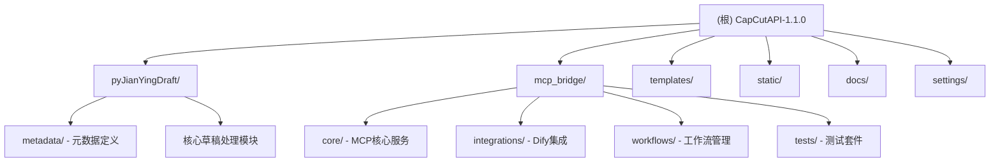

# CapCutAPI 项目文档

> 本文档由 AI 架构师自动生成和维护，最后更新时间：2025-11-11 10:35:57

## 变更记录 (Changelog)

### 2025-11-11 10:35:57
- 初始化项目 AI 上下文文档
- 完成全仓架构分析和模块清点
- 生成根级与模块级文档结构

---

## 项目愿景

CapCutAPI 是一个轻量、灵活、易上手的剪映/CapCut API 工具，旨在构建全自动化视频剪辑/混剪流水线。项目提供 HTTP API 接口，支持远程调用和自动化处理，集成多种 AI 服务，适用于企业级视频内容生产场景。

**核心价值**：
- 提供标准化的剪映草稿创建和编辑 API
- 支持视频、音频、文本、图片、特效等多种素材的自动化添加
- 云端存储和跨平台兼容（Windows、Linux、macOS）
- 企业级 MCP Bridge 服务，支持 AI 工作流集成

---

## 架构总览

CapCutAPI 采用分层架构设计，核心由以下部分组成：

### 技术栈
- **语言**: Python 3.9+
- **Web 框架**: Flask
- **数据库**: SQLite (capcut.db, drafts.db)
- **云存储**: 阿里云 OSS
- **依赖库**: pyJianYingDraft（草稿处理核心）、imageio、oss2、requests

### 主要分层
1. **API 层** (`capcut_server.py`): Flask Web 服务，提供 30+ REST API 端点
2. **业务逻辑层**: 草稿创建、素材添加、特效处理、路径适配等实现模块
3. **数据层**: SQLite 数据库、草稿缓存（LRU）、OSS 云存储
4. **核心库层** (`pyJianYingDraft/`): 剪映草稿文件格式处理、元数据管理
5. **MCP 桥接层** (`mcp_bridge/`): 企业级 MCP 协议桥接服务

---

## 模块结构图



---

## 模块索引

| 模块路径 | 职责描述 | 入口文件 | 状态 |
|---------|---------|---------|------|
| `/` (根) | Flask API 服务主入口，路由定义 | `capcut_server.py` | ✅ 核心 |
| `pyJianYingDraft/` | 剪映草稿文件格式处理核心库 | `__init__.py` | ✅ 核心 |
| `pyJianYingDraft/metadata/` | 特效、字体、动画等元数据定义 | `__init__.py` | ✅ 核心 |
| `mcp_bridge/` | MCP 协议桥接服务（企业级） | `core/bridge_server.py` | ✅ 核心 |
| `mcp_bridge/core/` | MCP 服务核心：路由、缓存、监控 | `capcut_mcp_server.py` | ✅ 核心 |
| `mcp_bridge/integrations/` | Dify 等平台的 MCP 集成适配器 | `dify_workflow_integration.py` | ✅ 扩展 |
| `mcp_bridge/workflows/` | 工作流管理和验证 | `workflow_manager.py` | ✅ 扩展 |
| `templates/` | Flask HTML 模板（预览、仪表板） | `index.html` | ✅ 前端 |
| `static/` | 静态资源（HTML、脚本、辅助工具） | - | ✅ 前端 |
| `docs/` | 项目文档（部署、API、故障排除） | 多个 `.md` 文件 | ✅ 文档 |
| `settings/` | 配置管理模块 | `__init__.py` | ✅ 配置 |

---

## 运行与开发

### 环境要求
- Python 3.9 或更高版本（推荐 `/usr/local/bin/python3.9`）
- FFmpeg（用于视频处理）
- 系统支持 systemd（用于服务管理）

### 快速启动

#### 方式 1：使用管理脚本（推荐）
```bash
./service_manager.sh start      # 启动服务
./service_manager.sh status     # 查看状态
./service_manager.sh logs       # 查看日志
./service_manager.sh test       # 测试服务
./service_manager.sh restart    # 重启服务
./service_manager.sh stop       # 停止服务
```

#### 方式 2：使用 systemd
```bash
sudo systemctl start capcutapi.service
sudo systemctl status capcutapi.service
tail -f logs/capcutapi.log
```

#### 方式 3：直接运行（开发）
```bash
# 安装依赖
pip install -r requirements.txt

# 配置文件
cp config.json.example config.json
vim config.json  # 编辑配置（端口、OSS 等）

# 启动服务
python capcut_server.py
```

### 主要 API 端点
| 端点 | 方法 | 说明 |
|------|------|------|
| `/create_draft` | POST | 创建新草稿 |
| `/add_video` | POST | 添加视频素材 |
| `/add_audio` | POST | 添加音频素材 |
| `/add_text` | POST | 添加文本素材 |
| `/add_subtitle` | POST | 添加字幕 |
| `/add_effect` | POST | 添加特效 |
| `/save_draft` | POST | 保存草稿（本地或云端） |
| `/api/drafts/dashboard` | GET | 草稿管理仪表板 |
| `/draft/preview/<draft_id>` | GET | 草稿预览页面 |

*完整 API 列表（30+ 端点）参见 [API_USAGE_EXAMPLES.md](docs/API_USAGE_EXAMPLES.md)*

### MCP Bridge 服务
```bash
# 进入 MCP Bridge 目录
cd mcp_bridge

# 启动 MCP Bridge 服务（端口 8082）
SERVER_PORT=8082 ./venv/bin/python core/bridge_server.py

# 健康检查
curl http://localhost:8082/health

# 性能指标
curl http://localhost:8082/metrics
```

---

## 测试策略

### 测试文件分布
- **单元测试**: `test_api.py`, `test_template.py`
- **端到端测试**: `test_e2e.py`
- **MCP Bridge 测试**:
  - 单元: `mcp_bridge/tests/unit/test_units.py`
  - 集成: `mcp_bridge/tests/integration/test_integration.py`
  - 性能: `mcp_bridge/tests/performance/test_performance.py`

### 运行测试
```bash
# 主服务 API 测试
python test_api.py

# 端到端测试
python test_e2e.py

# MCP Bridge 测试
cd mcp_bridge
pytest tests/
```

### 集成测试
项目提供 `rest_client_test.http` 文件，可使用 VS Code REST Client 插件或 IntelliJ HTTP Client 进行 API 测试。

---

## 编码规范

### 核心约定
1. **Python 版本**: 3.9+，优先使用 `/usr/local/bin/python3.9`
2. **依赖管理**: 所有第三方库记录在 `requirements.txt`
3. **配置文件**: 敏感信息优先使用环境变量（`OSS_*`, `MP4_OSS_*`）
4. **日志规范**: 使用 `logging` 模块，输出到 `logs/capcutapi.log`
5. **错误处理**: 统一返回 JSON 格式错误响应

### 路径处理规范（重要）
- **支持相对路径**: `./downloads`, `../output`, `~/Documents`（v1.3.0+）
- **跨平台适配**: 自动识别并转换 Windows (`\`) 和 Linux (`/`) 路径分隔符
- **路径优先级**:
  1. API 参数 `draft_folder`
  2. 用户自定义路径 (`path_config.json`)
  3. 客户端操作系统默认路径（根据 `client_os` 参数）
  4. 服务器操作系统默认路径

### 草稿保存模式
通过 `config.json` 的 `is_upload_draft` 字段控制：
- `true`: OSS 云存储模式（生产环境）
- `false`: 本地保存模式（开发测试）

---

## AI 使用指引

### 代码修改注意事项
1. **不要修改** `pyJianYingDraft/` 核心库（除非明确需要）
2. **优先扩展** API 路由和实现模块（`add_*_impl.py`, `save_draft_impl.py`）
3. **配置安全**: 避免硬编码 OSS 密钥，使用环境变量
4. **路径处理**: 使用 `path_utils.py` 模块的工具函数

### 常见开发任务
- **新增 API 端点**: 在 `capcut_server.py` 添加 `@app.route` 路由
- **新增素材类型**: 参考 `add_video_impl.py` 创建对应实现文件
- **修改草稿逻辑**: 编辑 `create_draft.py` 或 `save_draft_impl.py`
- **新增特效元数据**: 在 `pyJianYingDraft/metadata/` 下添加相应定义

### 部署与维护
- **部署文档**: [docs/CapCutAPI部署总结.md](docs/CapCutAPI部署总结.md)
- **故障排除**: [docs/TROUBLESHOOTING.md](docs/TROUBLESHOOTING.md)
- **API 示例**: [docs/API_USAGE_EXAMPLES.md](docs/API_USAGE_EXAMPLES.md)
- **MCP 集成**: [mcp_bridge/docs/实施指南.md](mcp_bridge/docs/实施指南.md)

### 调试技巧
```bash
# 查看实时日志
tail -f logs/capcutapi.log

# 查看草稿缓存
curl http://localhost:9000/debug/cache/<draft_id>

# 查看草稿列表
curl http://localhost:9000/api/drafts/list

# 测试路径配置
curl http://localhost:9000/api/os/info
```

---

## 相关文档索引

### 核心文档
- [需求文档](docs/REQUIREMENTS_DOCUMENT.md)
- [操作手册](docs/OPERATION_MANUAL.md)
- [API 使用示例](docs/API_USAGE_EXAMPLES.md)
- [故障排除指南](docs/TROUBLESHOOTING.md)

### 部署文档
- [部署总结](docs/CapCutAPI部署总结.md)
- [技术架构](docs/CLAUDE.md)
- [数据流分析](docs/CapCutAPI_数据流分析文档.md)
- [跨平台兼容性](docs/CapCutAPI_跨平台素材识别问题解决方案.md)

### MCP Bridge 文档
- [实施指南](mcp_bridge/docs/实施指南.md)
- [Dify 集成指南](mcp_bridge/docs/Dify集成指南.md)
- [部署方案对比](mcp_bridge/docs/MCP部署方案对比.md)
- [实施路线图](mcp_bridge/docs/实施路线图.md)

---

**提示**: 本文档是项目的"地图"，帮助开发者和 AI 快速定位信息。详细的模块文档请查看各模块目录下的 `CLAUDE.md` 文件。
