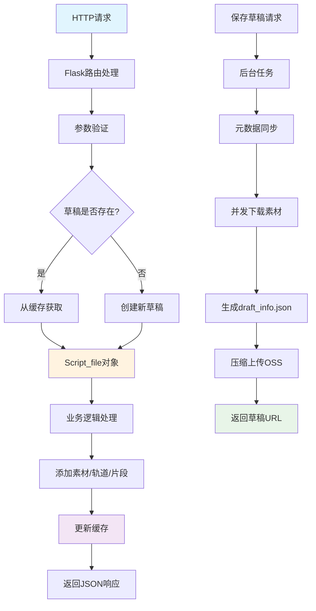
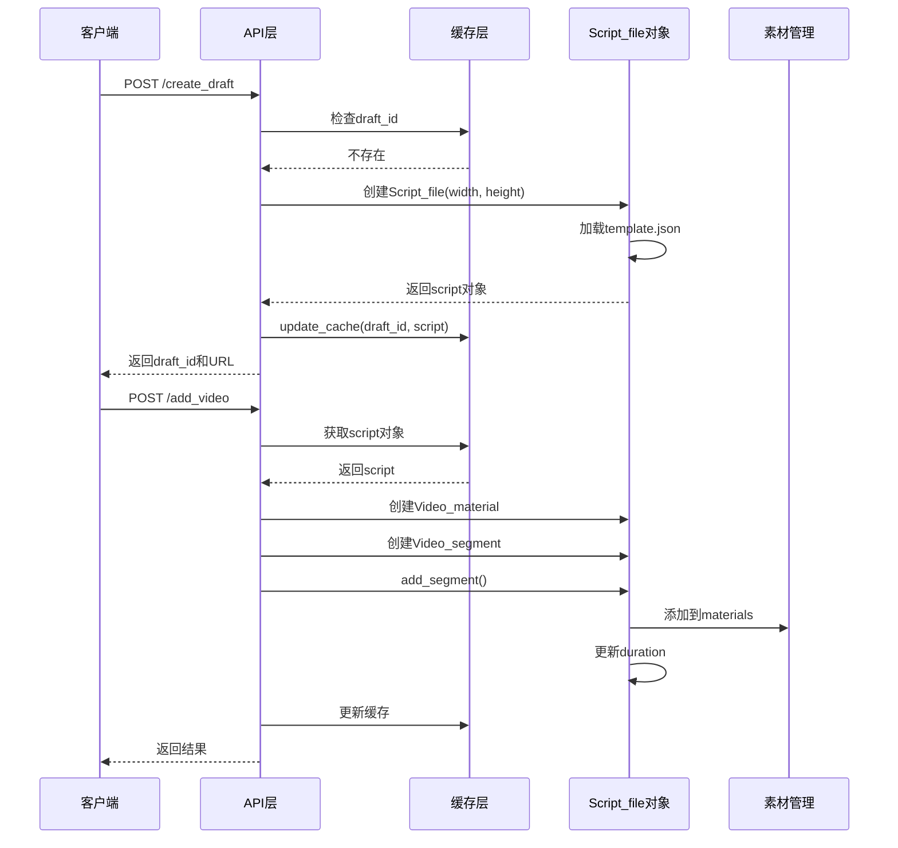
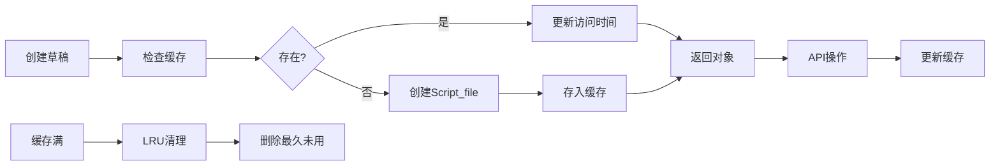
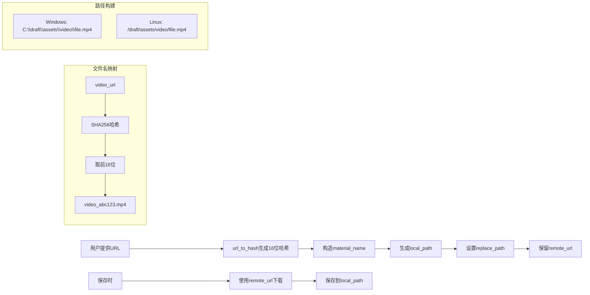
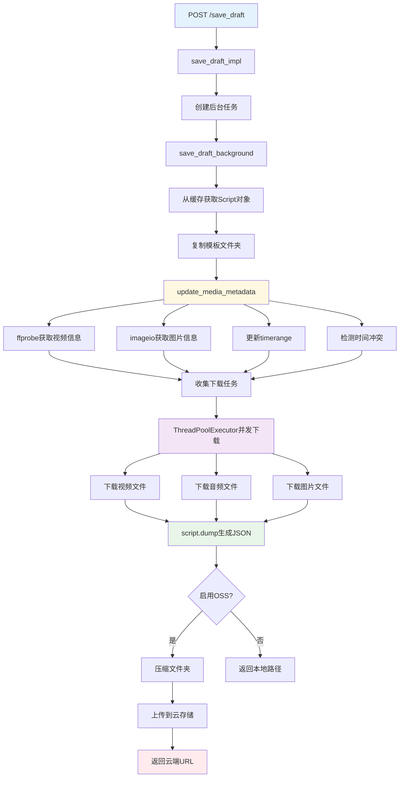

# CapCutAPI 数据流分析文档

## 📋 项目概述

**CapCutAPI** 是一个基于Python的剪映/CapCut自动化处理工具，通过HTTP API接口实现程序化的视频编辑功能。本文档详细分析项目的数据流转过程、架构设计和关键机制。

## 🏗️ 整体架构

```
┌─────────────────┐    ┌─────────────────┐    ┌─────────────────┐
│   HTTP API层    │    │   业务逻辑层    │    │   数据存储层    │
│                 │    │                 │    │                 │
│ • Flask路由     │───▶│ • 草稿管理      │───▶│ • 内存缓存      │
│ • 参数验证      │    │ • 素材处理      │    │ • Script对象    │
│ • 响应格式化    │    │ • 轨道管理      │    │ • LRU算法       │
│ • 错误处理      │    │ • 特效处理      │    │ • JSON序列化    │
└─────────────────┘    └─────────────────┘    └─────────────────┘
                                │
                                ▼
                       ┌─────────────────┐
                       │   文件系统层    │
                       │                 │
                       │ • 素材下载      │
                       │ • 文件路径管理  │
                       │ • 跨平台适配    │
                       │ • 云存储集成    │
                       └─────────────────┘
```

## 🔄 核心数据流程

### 1. 总体数据流向



### 2. API请求处理流程



## 📊 数据结构层次

### Script_file 核心数据对象

```python
Script_file (草稿文件核心对象)
├── content: Dict               # JSON模板内容
├── width, height, fps          # 基本视频属性  
├── duration: int               # 总时长(微秒)
├── materials: Script_material  # 素材管理容器
│   ├── audios: List[Audio_material]     # 音频素材
│   ├── videos: List[Video_material]     # 视频素材  
│   ├── audio_effects: List[Audio_effect] # 音频特效
│   ├── video_effects: List[Video_effect] # 视频特效
│   ├── animations: List[Segment_animations] # 动画
│   ├── transitions: List[Transition]     # 转场
│   ├── speeds: List[Speed]              # 变速
│   └── masks, filters, canvases         # 其他效果
└── tracks: Dict[str, Track]    # 轨道集合
    └── Track                   # 单个轨道
        ├── track_type         # 轨道类型(video/audio/text/effect)
        ├── render_index       # 渲染层级
        └── segments: List[Segment] # 片段列表
            └── Segment        # 片段对象
                ├── Video_segment, Audio_segment, Text_segment
                ├── target_timerange    # 目标时间范围
                ├── source_timerange    # 源时间范围  
                ├── material_instance   # 关联素材实例
                ├── speed              # 播放速度
                └── 各种效果设置
```

### 关键数据类型说明

| 数据类型 | 说明 | 示例 |
|---------|------|------|
| `draft_id` | 草稿唯一标识 | `dfd_cat_1234567890_abc12345` |
| `Timerange` | 时间范围对象 | `Timerange(start=0, duration=5000000)` (微秒) |
| `material_id` | 素材唯一标识 | `video_a1b2c3d4e5f6g7h8` |
| `track_name` | 轨道名称 | `video_main`, `audio_01`, `text_subtitle` |

## 🗂️ 缓存管理机制

### LRU缓存设计

```python
# draft_cache.py 关键实现
DRAFT_CACHE: OrderedDict = OrderedDict()  # LRU缓存容器
MAX_CACHE_SIZE = 10000                     # 最大缓存数量

def update_cache(key: str, value: draft.Script_file):
    """更新LRU缓存"""
    if key in DRAFT_CACHE:
        DRAFT_CACHE.pop(key)  # 删除旧项，准备重新插入
    elif len(DRAFT_CACHE) >= MAX_CACHE_SIZE:
        DRAFT_CACHE.popitem(last=False)  # 删除最久未使用项
    DRAFT_CACHE[key] = value  # 添加到末尾(最近使用)
```

### 缓存生命周期



## 🎬 素材处理数据流

### URL到本地文件映射



### 素材处理关键流程

#### 1. 创建阶段（快速响应）
```python
# 使用默认值，避免网络延迟
Video_material(
    material_name="video_abc123.mp4",
    remote_url="http://example.com/video.mp4", 
    duration=0,        # 默认值
    width=0,           # 默认值
    height=0           # 默认值
)
```

#### 2. 保存阶段（元数据同步）
```python
def update_media_metadata(script):
    """更新素材元数据"""
    for video in script.materials.videos:
        if video.material_type == 'video':
            # 使用ffprobe获取真实信息
            info = get_video_info_with_ffprobe(video.remote_url)
            video.width = info['width']
            video.height = info['height'] 
            video.duration = int(info['duration'] * 1000000)  # 转换为微秒
            
            # 调整所有关联片段的时间范围
            adjust_segment_timeranges(script, video)
```

## ⏰ 时间管理系统

### 时间范围对象设计

```python
class Timerange:
    """时间范围对象，微秒精度"""
    def __init__(self, start: int, duration: int):
        self.start = start      # 开始时间(微秒)
        self.duration = duration # 持续时间(微秒)
    
    @property
    def end(self) -> int:
        return self.start + self.duration

# 使用示例
source_timerange = Timerange(0, 10_000_000)       # 源素材0-10秒
target_timerange = Timerange(5_000_000, 5_000_000) # 放置在5-10秒
```

### 时间冲突处理机制

```python
def check_and_resolve_conflicts(script):
    """检测并解决时间冲突"""
    for track_name, track in script.tracks.items():
        to_remove = set()
        
        # 检测所有片段间的冲突
        for i in range(len(track.segments)):
            for j in range(i + 1, len(track.segments)):
                if track.segments[i].overlaps(track.segments[j]):
                    # 保留较早添加的片段
                    later_index = max(i, j)
                    to_remove.add(later_index)
                    logger.warning(f"删除冲突片段: {track.segments[later_index].segment_id}")
        
        # 从后往前删除，避免索引变化
        for index in sorted(to_remove, reverse=True):
            track.segments.pop(index)
```

### 播放速度计算

```python
# 速度对时间的影响
source_duration = 10_000_000  # 10秒(微秒)
speed = 2.0                   # 2倍速播放
target_duration = int(source_duration / speed)  # 实际占用5秒

# 创建片段时的时间计算
video_segment = Video_segment(
    material=video_material,
    source_timerange=Timerange(start, source_duration),
    target_timerange=Timerange(target_start, target_duration),
    speed=speed
)
```

## 💾 保存草稿完整流程

### 后台任务处理流程



### 元数据同步详细步骤

```python
def update_media_metadata(script, task_id=None):
    """同步所有素材的元数据"""
    
    # 1. 处理音频文件
    for audio in script.materials.audios:
        try:
            # 检测是否包含视频流
            check_video_streams(audio.remote_url)
            
            # 获取音频时长
            duration = get_audio_duration(audio.remote_url)
            audio.duration = int(duration * 1000000)  # 转换为微秒
            
            # 更新关联片段的时间范围
            update_audio_segments_timerange(script, audio)
            
        except Exception as e:
            logger.error(f"处理音频 {audio.material_name} 失败: {e}")
    
    # 2. 处理视频文件
    for video in script.materials.videos:
        if video.material_type == 'video':
            try:
                # 使用ffprobe获取详细信息
                info = get_video_info_with_ffprobe(video.remote_url)
                video.width = info['width']
                video.height = info['height']
                video.duration = int(info['duration'] * 1000000)
                
                # 更新关联片段
                update_video_segments_timerange(script, video)
                
            except Exception as e:
                logger.error(f"处理视频 {video.material_name} 失败: {e}")
                # 使用默认值
                video.width = 1920
                video.height = 1080
                
        elif video.material_type == 'photo':
            try:
                # 使用imageio获取图片尺寸
                img = imageio.imread(video.remote_url)
                video.height, video.width = img.shape[:2]
                
            except Exception as e:
                logger.error(f"处理图片 {video.material_name} 失败: {e}")
                video.width = 1920
                video.height = 1080
    
    # 3. 处理待处理的关键帧
    for track_name, track in script.tracks.items():
        if hasattr(track, 'pending_keyframes'):
            track.process_pending_keyframes()
    
    # 4. 重新计算总时长
    max_duration = 0
    for track in script.tracks.values():
        for segment in track.segments:
            max_duration = max(max_duration, segment.end)
    script.duration = max_duration
```

### 并发下载机制

```python
def execute_concurrent_downloads(download_tasks):
    """并发执行下载任务"""
    downloaded_paths = []
    completed_files = 0
    
    # 使用线程池，最大16个并发
    with ThreadPoolExecutor(max_workers=16) as executor:
        # 提交所有下载任务
        future_to_task = {
            executor.submit(task['func'], *task['args']): task 
            for task in download_tasks
        }
        
        # 等待任务完成
        for future in as_completed(future_to_task):
            task = future_to_task[future]
            try:
                local_path = future.result()
                downloaded_paths.append(local_path)
                
                # 更新进度
                completed_files += 1
                progress = 10 + int((completed_files / len(download_tasks)) * 60)
                update_task_progress(task_id, progress, 
                                   f"已下载 {completed_files}/{len(download_tasks)} 个文件")
                
            except Exception as e:
                logger.error(f"下载 {task['type']} 文件失败: {e}")
                # 继续处理其他文件，不中断整体流程
                continue
    
    return downloaded_paths
```

## 🌐 跨平台适配机制

### 路径处理适配

```python
def build_asset_path(draft_folder: str, draft_id: str, asset_type: str, material_name: str) -> str:
    """构建跨平台资源文件路径"""
    
    if is_windows_path(draft_folder):
        if os.name == 'nt':  # 在Windows系统上
            return os.path.join(draft_folder, draft_id, "assets", asset_type, material_name)
        else:  # 在非Windows系统上处理Windows路径
            # 解析Windows路径格式: C:\path\to\folder
            windows_drive, windows_path = re.match(r'([a-zA-Z]:)(.*)', draft_folder).groups()
            parts = [p for p in windows_path.split('\\') if p]
            path = os.path.join(windows_drive, *parts, draft_id, "assets", asset_type, material_name)
            return path.replace('/', '\\')  # 保持Windows路径格式
    else:
        # Linux/macOS路径处理
        return os.path.join(draft_folder, draft_id, "assets", asset_type, material_name)

def is_windows_path(path: str) -> bool:
    """检测是否为Windows风格路径"""
    return re.match(r'^[a-zA-Z]:\\|\\\\', path) is not None
```

### 环境配置适配

```python
# 根据配置选择对应的元数据类型
def get_transition_type(transition_name: str):
    """根据环境获取转场类型"""
    if IS_CAPCUT_ENV:
        return getattr(CapCut_Transition_type, transition_name)
    else:
        return getattr(Transition_type, transition_name)

def get_mask_type(mask_name: str):
    """根据环境获取遮罩类型"""
    if IS_CAPCUT_ENV:
        return getattr(CapCut_Mask_type, mask_name)
    else:
        return getattr(Mask_type, mask_name)

# 导出时的条件处理
def export_materials(self) -> Dict[str, Any]:
    """导出素材信息"""
    result = {
        # ... 其他素材类型
    }
    
    # 根据环境决定遮罩字段名
    if IS_CAPCUT_ENV:
        result["common_mask"] = self.masks
    else:
        result["masks"] = self.masks
        
    return result
```

## 🛡️ 错误处理与容错机制

### 多层异常处理策略

```python
# 1. API层：统一格式处理
@app.route('/add_video', methods=['POST'])
def add_video():
    result = {"success": False, "output": "", "error": ""}
    
    try:
        # 参数验证
        data = request.get_json()
        if not data.get('video_url'):
            result["error"] = "必需参数 'video_url' 缺失"
            return jsonify(result)
        
        # 业务逻辑调用
        draft_result = add_video_track(**data)
        
        result["success"] = True
        result["output"] = draft_result
        
    except ValueError as e:
        result["error"] = f"参数错误: {str(e)}"
    except Exception as e:
        result["error"] = f"处理视频时发生错误: {str(e)}"
    
    return jsonify(result)

# 2. 业务层：具体异常处理
def add_video_track(video_url: str, **kwargs):
    """添加视频轨道"""
    
    # 参数验证
    if not video_url:
        raise ValueError("video_url 参数不能为空")
    
    try:
        # 获取或创建草稿
        draft_id, script = get_or_create_draft(kwargs.get('draft_id'))
        
        # 创建视频素材
        video_material = create_video_material(video_url, **kwargs)
        
        # 添加到轨道
        script.add_segment(video_segment, kwargs.get('track_name'))
        
        return {"draft_id": draft_id, "draft_url": generate_draft_url(draft_id)}
        
    except exceptions.TrackNotFound as e:
        raise ValueError(f"轨道不存在: {str(e)}")
    except Exception as e:
        logger.error(f"添加视频轨道失败: {str(e)}", exc_info=True)
        raise

# 3. 文件层：降级处理
def get_video_metadata(video_url: str) -> Dict[str, Any]:
    """获取视频元数据，失败时使用默认值"""
    
    try:
        # 尝试使用ffprobe获取信息
        result = subprocess.run([
            'ffprobe', '-v', 'error', '-select_streams', 'v:0',
            '-show_entries', 'stream=width,height,duration',
            '-of', 'json', video_url
        ], capture_output=True, text=True, timeout=30)
        
        if result.returncode == 0:
            info = json.loads(result.stdout)
            stream = info['streams'][0]
            return {
                'width': int(stream.get('width', 1920)),
                'height': int(stream.get('height', 1080)),
                'duration': float(stream.get('duration', 0))
            }
    except (subprocess.TimeoutExpired, json.JSONDecodeError, IndexError, KeyError) as e:
        logger.warning(f"获取视频元数据失败，使用默认值: {str(e)}")
    
    # 返回默认值
    return {'width': 1920, 'height': 1080, 'duration': 0}
```

### 下载容错机制

```python
def download_with_retry(url: str, local_path: str, max_retries: int = 3) -> str:
    """带重试机制的文件下载"""
    
    for attempt in range(max_retries):
        try:
            # 创建目录
            os.makedirs(os.path.dirname(local_path), exist_ok=True)
            
            # 下载文件
            response = requests.get(url, stream=True, timeout=30)
            response.raise_for_status()
            
            with open(local_path, 'wb') as f:
                for chunk in response.iter_content(chunk_size=8192):
                    f.write(chunk)
            
            logger.info(f"成功下载: {url} -> {local_path}")
            return local_path
            
        except Exception as e:
            logger.warning(f"下载失败 (尝试 {attempt + 1}/{max_retries}): {str(e)}")
            if attempt < max_retries - 1:
                time.sleep(2 ** attempt)  # 指数退避
            else:
                logger.error(f"下载最终失败: {url}")
                raise
```

## 📈 性能优化策略

### 1. 缓存策略

- **内存优先**: 所有操作基于内存中的Script_file对象
- **LRU管理**: 自动清理最久未使用的草稿缓存
- **延迟计算**: 创建时使用默认值，保存时才获取真实元数据

### 2. 并发处理

- **线程池下载**: 最大16个并发连接下载素材文件  
- **异步任务**: 保存操作在后台异步执行
- **进度反馈**: 实时更新任务状态和下载进度

### 3. 资源管理

- **文件哈希化**: URL转换为固定长度哈希，避免重复下载
- **路径优化**: 合理的目录结构和文件命名
- **内存控制**: 限制缓存大小，防止内存泄漏

## 🔧 关键设计模式

### 1. 惰性计算模式

```python
# 创建时：快速响应
Video_material(duration=0, width=0, height=0)  # 使用默认值

# 保存时：获取真实信息  
def save_draft():
    update_media_metadata(script)  # 同步真实元数据
    download_all_materials()       # 下载所有文件
```

**优势**：
- 减少API响应延迟
- 避免不必要的网络请求
- 提升用户体验

### 2. 增量构建模式

```python
# 每次API调用都是增量操作
script = get_draft_from_cache(draft_id)
script.add_segment(new_segment)  # 增量添加
update_cache(draft_id, script)   # 更新缓存
```

**优势**：
- 支持复杂的编辑流程
- 保持数据一致性
- 便于撤销和重做

### 3. 工厂模式

```python
def create_segment_by_type(segment_type: str, **kwargs):
    """根据类型创建相应的片段对象"""
    if segment_type == 'video':
        return Video_segment(**kwargs)
    elif segment_type == 'audio':
        return Audio_segment(**kwargs)
    elif segment_type == 'text':
        return Text_segment(**kwargs)
    else:
        raise ValueError(f"不支持的片段类型: {segment_type}")
```

### 4. 观察者模式

```python
class TaskStatusTracker:
    """任务状态追踪器"""
    
    def __init__(self, task_id: str):
        self.task_id = task_id
        self.observers = []
    
    def add_observer(self, observer):
        self.observers.append(observer)
    
    def update_progress(self, progress: int, message: str):
        # 更新任务状态
        update_task_field(self.task_id, "progress", progress)
        update_task_field(self.task_id, "message", message)
        
        # 通知所有观察者
        for observer in self.observers:
            observer.on_progress_update(progress, message)
```

## 📋 数据流关键节点

### 1. 数据转换节点

| 转换点 | 输入格式 | 输出格式 | 处理函数 |
|--------|----------|----------|----------|
| HTTP参数解析 | JSON字符串 | Python字典 | `request.get_json()` |
| URL哈希化 | 网络URL | 本地文件名 | `url_to_hash()` |
| 时间格式转换 | 秒数/时间字符串 | 微秒整数 | `tim()` |
| 路径构建 | 相对路径 | 绝对路径 | `build_asset_path()` |
| 对象序列化 | Script_file对象 | JSON字符串 | `script.dumps()` |

### 2. 状态检查点

```python
# 关键状态检查点
CHECKPOINTS = {
    'draft_created': '草稿创建完成',
    'materials_added': '素材添加完成', 
    'metadata_synced': '元数据同步完成',
    'files_downloaded': '文件下载完成',
    'json_generated': 'JSON文件生成完成',
    'upload_completed': '上传完成'
}

def checkpoint(name: str, data: Any = None):
    """记录检查点状态"""
    logger.info(f"检查点 [{name}]: {CHECKPOINTS.get(name, '未知状态')}")
    if data:
        logger.debug(f"检查点数据: {data}")
```

## 🔍 调试与监控

### 日志系统

```python
import logging

# 配置日志格式
logging.basicConfig(
    level=logging.INFO,
    format='%(asctime)s [%(levelname)s] %(name)s: %(message)s',
    handlers=[
        logging.FileHandler('logs/capcutapi.log'),
        logging.StreamHandler()
    ]
)

logger = logging.getLogger('capcutapi')

# 关键操作日志记录
def log_operation(operation: str, draft_id: str, **kwargs):
    """记录关键操作"""
    logger.info(f"操作: {operation}, 草稿ID: {draft_id}, 参数: {kwargs}")
```

### 性能监控

```python
import time
import functools

def timing_decorator(func_name: str):
    """性能监控装饰器"""
    def decorator(func):
        @functools.wraps(func)
        def wrapper(*args, **kwargs):
            start_time = time.time()
            logger.info(f"[{func_name}] 开始执行...")
            
            try:
                result = func(*args, **kwargs)
                end_time = time.time()
                duration = end_time - start_time
                logger.info(f"[{func_name}] 执行完成，耗时: {duration:.3f}秒")
                return result
            except Exception as e:
                end_time = time.time()
                duration = end_time - start_time
                logger.error(f"[{func_name}] 执行失败，耗时: {duration:.3f}秒，错误: {e}")
                raise
        return wrapper
    return decorator

# 使用示例
@timing_decorator("保存草稿")
def save_draft_background(draft_id: str, draft_folder: str, task_id: str):
    # 执行保存逻辑
    pass
```

## 📚 扩展与维护

### 添加新的素材类型

```python
# 1. 定义新的素材类
class NewMaterial(Video_material):
    def __init__(self, material_type: str = 'new_type', **kwargs):
        super().__init__(material_type=material_type, **kwargs)
    
    def export_json(self) -> Dict[str, Any]:
        result = super().export_json()
        result.update({
            'new_property': self.new_property
        })
        return result

# 2. 定义对应的片段类
class NewSegment(Video_segment):
    def __init__(self, material: NewMaterial, **kwargs):
        super().__init__(material, **kwargs)

# 3. 添加API端点
@app.route('/add_new_material', methods=['POST'])
def add_new_material():
    # 实现新素材的添加逻辑
    pass

# 4. 更新Script_material类
class Script_material:
    def __init__(self):
        # 添加新的素材列表
        self.new_materials = []
```

### 性能优化建议

1. **数据库持久化**: 考虑将草稿信息持久化到数据库
2. **Redis缓存**: 使用Redis替代内存缓存，支持分布式部署
3. **CDN加速**: 将素材文件缓存到CDN，提升下载速度
4. **批量操作**: 支持批量添加素材，减少API调用次数
5. **流式处理**: 对于大文件，采用流式处理避免内存溢出

## 📖 总结

CapCutAPI的数据流设计体现了以下特点：

### 优势
- **高性能**: 缓存优先策略，减少磁盘I/O
- **高可靠**: 多层容错机制，确保服务稳定
- **高扩展**: 模块化设计，便于功能扩展
- **跨平台**: 良好的平台兼容性
- **用户友好**: 快速响应，异步处理

### 适用场景
- 批量视频处理
- 自动化视频编辑
- 视频内容生产流水线
- 多媒体内容管理系统

### 技术栈
- **后端框架**: Flask
- **核心库**: pyJianYingDraft
- **并发处理**: ThreadPoolExecutor
- **媒体处理**: ffprobe, imageio
- **存储**: 本地文件系统 + 云存储

这个数据流架构为视频编辑自动化提供了强大而灵活的基础，支持复杂的编辑需求同时保证了系统的性能和稳定性。

---

*文档版本: 1.0*  
*最后更新: 2024年12月*  
*作者: CapCutAPI开发团队*