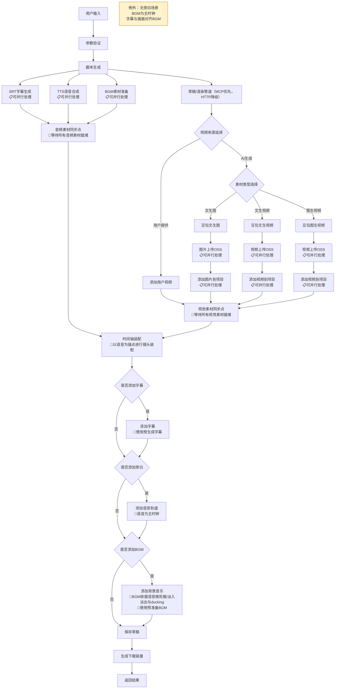
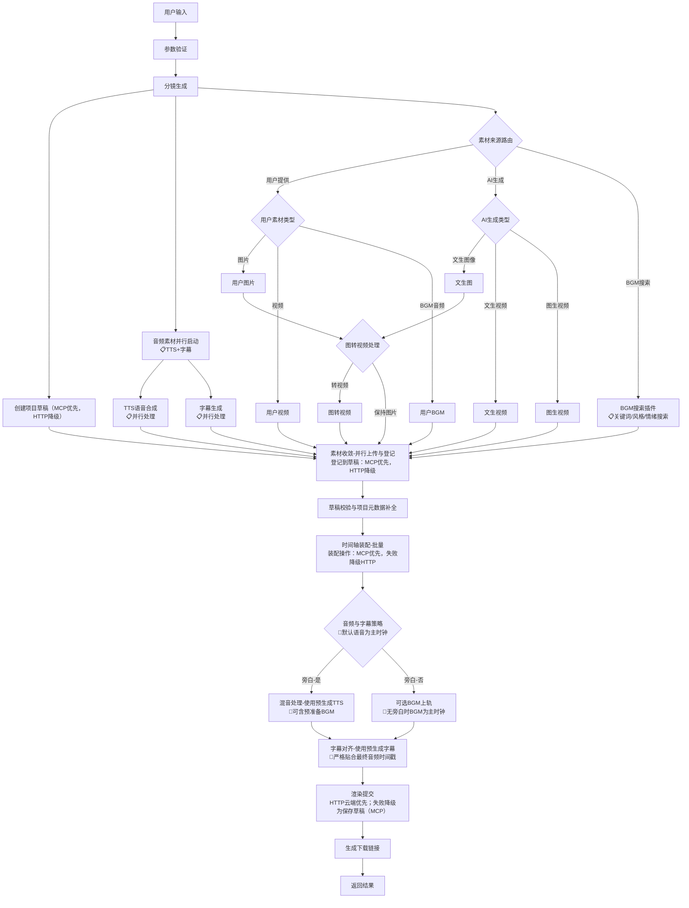
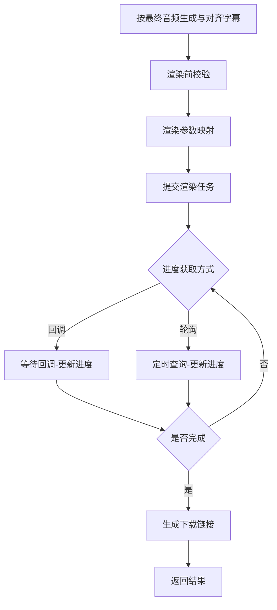
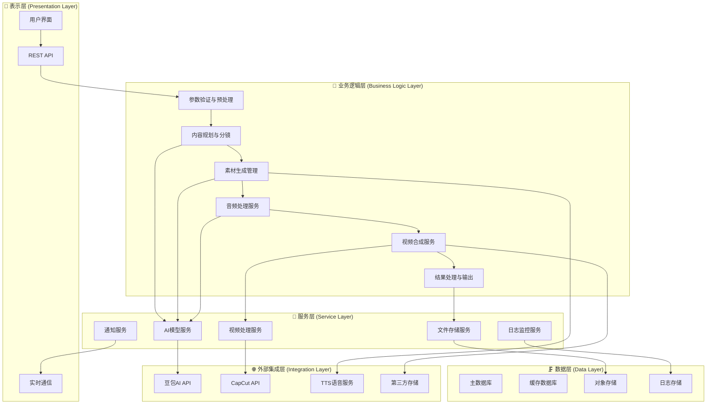
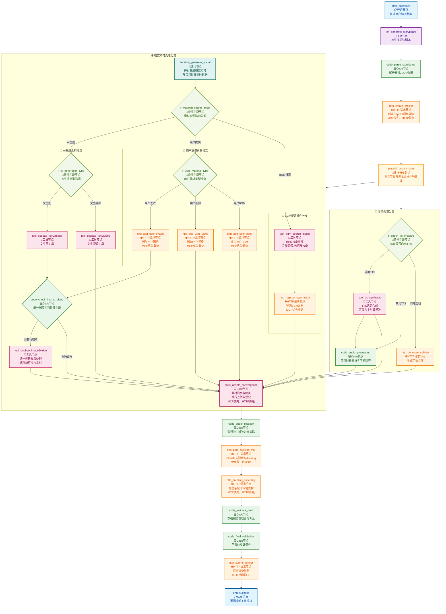
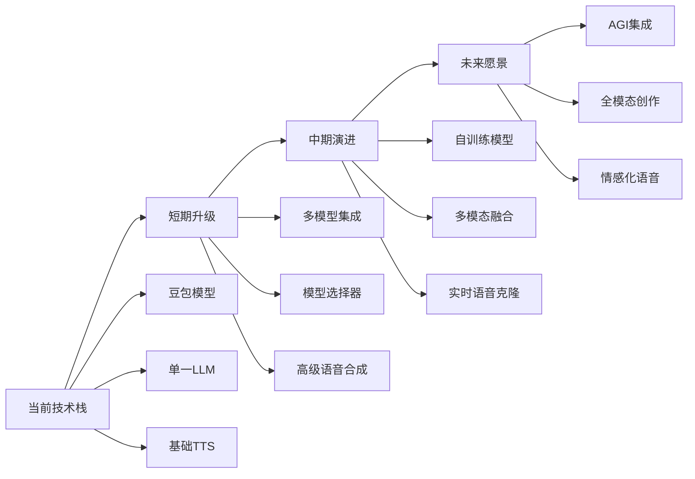

# 一键生成短视频工作流优化 - 产品需求文档（PRD）

## 文档信息

| 项目 | 内容 |
|------|------|
| **产品名称** | 智能短视频生成工作流平台 |
| **版本号** | v2.0 |
| **文档版本** | v2.2 |
| **创建日期** | 2025年1月27日 |
| **最后更新** | 2025年9月15日 |
| **负责人** | AI助手团队 |
| **技术栈** | Dify平台 + 豆包AI + CapCut API + TTS语音合成 + MCP Bridge（可选） |

## 0. 变更摘要与总览

本次 v2.2 修订围绕可落地、可观测、可回滚三大目标，完成以下优化：
- 完整性补强：补齐数据契约、环境变量与配置开关、异常与降级策略、灰度与回滚流程。
- 逻辑合理性：统一分镜→素材→时长/音画→渲染→回传的单一关键路径，所有分支提供可验证的收敛点与失败处理。
- 兼容性评估：与现有 Dify 工作流、CapCutAPI-1.1.0 仓库、TTS 网关 OpenAPI 对齐，新增变量/字段均向后兼容或提供映射层。
- 风险应对：扩充技术/业务/合规风险库与缓解、应急预案，标注触发阈值与处置时限。
- 可测量性：明确 p50/p95、成功率、重试率、端到端耗时、分阶段耗时等指标定义、采集字段与仪表板口径。

关键里程碑“放行条件”（任一不达标不得上线）：
- 端到端成功率≥95%，95% 任务 ≤300s 完成；
- 关键路径异常覆盖≥90%，且均有明确降级与用户可理解提示；
- 灰度 50% 时无新增 P0/P1 线上缺陷连续3天；
- 回滚演练通过（5分钟内恢复到稳定旧版，数据无丢失）。

与现有系统的对齐与差异：
- 继续保留 HTTP 能力，新增 MCP Bridge（可开关）；
- 节点统一命名/变量口径，保留“彻底修复版.yml”中的可用节点作为备用路径；
- TTS 网关严格遵循语音合成插件.yaml 的 schema，并补充超时/重试/切片规则。

## 1. 项目概述

### 1.1 项目背景

在数字化内容创作快速发展的背景下，短视频已成为最重要的内容传播形式。然而，专业短视频制作需要较高的技术门槛和时间成本，普通用户和中小企业难以快速产出高质量内容。

**当前痛点分析：**
- **技术门槛高**：传统视频制作需要专业软件和技能
- **制作周期长**：从创意到成片通常需要数小时甚至数天
- **成本投入大**：专业制作团队和设备成本昂贵
- **批量化困难**：个性化内容难以规模化生产
- **质量不稳定**：缺乏标准化流程导致质量参差不齐

**市场机会：**
- 短视频市场规模预计2025年突破2000亿元
- 中小企业对低成本视频营销需求激增
- AI技术成熟为自动化内容生产提供了可能
- 多平台分发需求推动标准化内容生产

### 1.2 产品愿景

打造一个智能化、模块化、易用性强的短视频自动生成平台，让任何人都能在5分钟内制作出专业级短视频内容。

**核心价值主张：**
- **智能化**：AI驱动的内容规划和素材生成
- **标准化**：统一的制作流程和质量标准
- **规模化**：支持批量内容生产
- **个性化**：灵活的定制选项满足不同需求

### 1.3 优化目标

#### 1.3.1 技术目标
- **简化架构**：将节点数量从40+减少到11个核心节点
- **提升性能**：平均生成时间从8-12分钟缩短至3-5分钟
- **增强稳定性**：系统成功率从85%提升至95%以上
- **优化体验**：用户操作步骤从15+减少至5步以内

#### 1.3.2 业务目标
- **扩大用户群体**：从技术用户扩展到普通创作者
- **提高使用频率**：日均使用次数提升200%
- **降低运营成本**：自动化程度提升60%
- **增强竞争力**：建立技术护城河

### 1.4 成功指标

| 指标类型 | 具体指标 | 当前值 | 目标值 | 达成时间 |
|---------|---------|--------|--------|---------|
| **用户体验** | 操作步骤 | 15+ | ≤5 | 2025Q1 |
| **系统性能** | 生成时间 | 8-12分钟 | 3-5分钟 | 2025Q1 |
| **系统稳定性** | 成功率 | 85% | ≥95% | 2025Q1 |
| **技术效率** | 节点数量 | 40+ | 11 | 2025Q1 |
| **维护成本** | 代码复杂度 | 高 | 低 | 2025Q2 |

## 2. 用户画像与使用场景

### 2.1 目标用户画像

#### 2.1.1 主要用户群体

**🎯 内容创作者**
- **用户特征**：自媒体博主、短视频UP主、内容创业者
- **核心需求**：快速产出高质量内容，降低制作成本
- **使用频率**：日均5-20个视频
- **技术水平**：中等，能理解基本操作
- **痛点**：创意枯竭、制作效率低、成本控制

**🏢 企业营销人员**
- **用户特征**：市场部、运营部、品牌推广人员
- **核心需求**：批量生产营销内容，保持品牌一致性
- **使用频率**：周均10-50个视频
- **技术水平**：初级到中级
- **痛点**：预算有限、人力不足、质量要求高

**🎓 教育工作者**
- **用户特征**：老师、培训师、在线教育从业者
- **核心需求**：制作教学视频、课程宣传片
- **使用频率**：周均3-15个视频
- **技术水平**：初级
- **痛点**：技术门槛、时间限制、预算约束

**🛍️ 电商从业者**
- **用户特征**：店铺运营、产品经理、带货主播
- **核心需求**：产品展示视频、直播素材
- **使用频率**：日均10-100个视频
- **技术水平**：初级到中级
- **痛点**：批量制作、成本控制、转化效果

#### 2.1.2 用户需求层次

```
高级需求 📈
├─ 个性化定制
├─ 批量自动化
├─ 数据分析
└─ API集成

基础需求 📋
├─ 快速生成
├─ 质量保证
├─ 操作简单
└─ 成本可控
```


### 2.2 核心使用场景

#### 2.2.1 产品介绍视频

**场景描述：**企业需要为新产品制作宣传视频

**用户流程：**
1. 输入产品名称和核心卖点
2. 选择视频风格（商务/时尚/科技等）
3. 上传产品图片（可选）
4. 设置视频时长（30秒/60秒）
5. 选择旁白音色和背景音乐
6. 一键生成并获取成品

**输出要求：**
- 视频比例：16:9（适合横屏平台）
- 时长：30-60秒
- 包含：产品展示、功能介绍、品牌露出
- 风格：专业、简洁、有吸引力

#### 2.2.2 教程说明视频

**场景描述：**教育机构制作课程预告或操作教程

**用户流程：**
1. 输入教程主题和步骤要点
2. 选择教学风格（严肃/轻松/互动等）
3. 设置视频时长（60秒/90秒）
4. 选择合适的旁白音色
5. 添加字幕和重点标注
6. 生成教学视频

**输出要求：**
- 视频比例：16:9或9:16
- 时长：60-90秒
- 包含：步骤演示、要点说明、总结回顾
- 风格：清晰、易懂、有条理

#### 2.2.3 营销推广短片

**场景描述：**电商店铺制作促销活动宣传视频

**用户流程：**
1. 输入活动信息和优惠内容
2. 选择营销风格（热烈/优雅/潮流等）
3. 设置视频比例（9:16适合抖音快手）
4. 选择动感背景音乐
5. 添加促销标语和价格信息
6. 快速生成营销视频

**输出要求：**
- 视频比例：9:16（适合竖屏平台）
- 时长：15-30秒
- 包含：产品展示、优惠信息、行动召唤
- 风格：动感、吸引眼球、转化导向

#### 2.2.4 社交媒体内容

**场景描述：**个人博主制作日常分享视频

**用户流程：**
1. 输入分享主题和个人观点
2. 选择个人风格（文艺/搞笑/知性等）
3. 上传相关图片或视频素材
4. 设置个性化字幕样式
5. 选择符合个人形象的音色
6. 生成个性化内容

**输出要求：**
- 视频比例：1:1或9:16
- 时长：15-60秒
- 包含：个人观点、生活场景、互动元素
- 风格：个性化、真实、有共鸣

### 2.3 用户体验设计原则

#### 2.3.1 易用性原则
- **零学习成本**：新用户5分钟内完成首个视频
- **向导式操作**：逐步引导，避免选择困难
- **智能默认值**：基于场景提供最优配置
- **实时预览**：每步操作都有即时反馈

#### 2.3.2 灵活性原则
- **模板化**：提供常用场景的预设模板
- **个性化**：支持用户自定义风格和参数
- **可扩展**：支持高级用户的深度定制
- **多平台适配**：一次制作，多平台分发

#### 2.3.3 效率性原则
- **批量处理**：支持同时生成多个视频
- **模板复用**：保存常用配置为模板
- **快速迭代**：支持快速修改和重新生成
- **自动优化**：AI智能优化参数配置

## 3. 现状分析

### 3.1 当前系统架构分析

#### 3.1.1 传统版本（豆包语音优化版）问题分析

**架构复杂性问题：**
- **节点数量过多**：40+个节点导致维护困难
- **流程图复杂**：用户和开发者都难以理解
- **分支逻辑冗余**：多个条件分支处理相似逻辑
- **数据传递混乱**：节点间数据格式不统一
- **调试困难**：问题定位需要检查多个节点

**用户体验问题：**
- **参数过多**：15+个参数对普通用户不友好
- **技术术语多**：如"CapCut API基础地址"等专业术语
- **缺乏进度反馈**：用户无法了解生成进度
- **错误提示不清**：失败时难以定位具体问题
- **学习成本高**：新用户需要较长时间熟悉

**技术债务问题：**
- **代码重复严重**：多个节点实现相似功能
- **硬编码问题**：部分参数和配置写死在节点中
- **缺乏统一标准**：节点命名和数据格式不规范
- **扩展性差**：新增功能需要修改多个节点
- **测试覆盖不足**：难以验证各个分支的正确性

#### 3.1.2 当前技术栈评估

**优势分析：**
- ✅ **Dify平台成熟**：提供了稳定的工作流执行环境
- ✅ **AI模型丰富**：豆包、SiliconFlow等多种模型可选
- ✅ **功能相对完整**：基本覆盖了短视频制作的全流程
- ✅ **社区支持良好**：有活跃的开发者社区

**劣势分析：**
- ❌ **平台依赖性强**：受Dify平台功能限制
- ❌ **调试工具有限**：缺乏专业的调试和监控工具
- ❌ **版本管理困难**：工作流版本控制能力有限
- ❌ **性能监控不足**：缺乏详细的性能分析数据

### 3.2 核心流程深度分析

#### 3.2.1 当前流程架构图（当前版本-待优化）



**图注说明：**
- 🎵 **音频对齐策略**：以语音为主时钟；BGM依据语音做剪裁/淡入淡出与ducking处理
- 🎯 **画面贴齐策略**：静帧延长/轻度变速/交叉溶解
- 📋 **并行处理**：视觉素材（图片/视频生成、上传、登记）与音频素材（TTS、BGM、字幕）可并行执行
- 🔄 **同步点设计**：设置音频素材同步点和视觉素材同步点，确保所有素材就绪后再进行时间轴装配
- 📝 **预生成优化**：字幕、TTS、BGM在早期阶段并行生成，后续装配时直接使用，避免重复计算
- ⚠️ **例外情况**：无旁白场景时，BGM为主时钟；字幕（如有）与画面对齐BGM
- 📖 **参考**：音频对齐线（Audio Master Clock）详见5.1.3节

优化后流程架构图（方案B-推荐）：



**图注说明（更新）：**
- 🎯 **素材来源优先分类**：第一层按来源分类（用户提供 vs AI生成 vs BGM搜索），避免混合处理逻辑
- 👤 **用户素材简化处理**：用户提供的视频/BGM直接进入素材收敛，图片统一进入图转视频处理
- 🤖 **AI生成分支优化**：AI生成的视频类素材直接收敛，图片类统一进入图转视频处理
- 🎵 **BGM搜索插件统一**：单一BGM搜索节点集成关键词、风格、情绪等多维度搜索功能
- 🔄 **图转视频统一处理**：所有图片素材（用户/AI）统一通过一个图转视频处理节点，减少重复逻辑
- ⚡ **并行优化**：视觉与音频素材在生成与登记阶段并行，降低总耗时
- 🗂 **草稿优先**：创建项目草稿前置，素材"登记到草稿"默认走 MCP，失败降级为 HTTP
- 🔧 **装配策略**：时间轴装配默认走 MCP 工程操作，失败降级为 HTTP 参数装配
- ☁ **渲染策略**：渲染提交默认云端 HTTP，失败降级为"仅保存草稿（MCP）"，避免流程全失败
- 🩺 **健康检查**：对 MCP 和 HTTP 通道进行健康检查与熔断，支持按错误类型分级重试
- 🎵 **主时钟**：默认语音为主时钟；无旁白时 BGM 为主时钟（参见 5.1.3 音频对齐线）
- 📝 **字幕对齐**：字幕严格贴合最终音频时间戳，使用预生成字幕避免重复计算
- 📋 **预生成复用**：TTS、BGM、字幕在早期并行生成，后续混音和对齐时直接使用
- 📖 **参考**：音频对齐线（Audio Master Clock）详见 5.1.3 节

渲染视频环节（细化）：



说明（与 5.1.7 对齐）：
- 渲染前校验：时间轴总时长、轨道冲突、字幕与音频边界、资源URL有效性。
- 参数映射：分辨率、编码、帧率、码率策略等。
- 装配执行：时间轴装配默认走 MCP 工程操作（批量轨道写入/移动/裁剪），当 MCP 不可用或失败达到阈值时，降级为 HTTP 参数装配（一次性提交渲染参数）。
- 提交任务：优先云端渲染（HTTP），失败自动降级为仅保存草稿（MCP），保留可恢复状态。
- 进度：支持回调或轮询；回调优先，轮询采用指数退避。
- 完成：返回成片与缩略图URL；失败触发重试或降级路径。
- 事件：render.started/progress/completed/failed/timeout 全链路可观测。

**架构图术语对齐说明：**

上述两张流程架构图均遵循"音频对齐线（Audio Master Clock）"设计原则（详见5.1.3节），确保整个工作流在音频时序管理上的一致性：

1. **主时钟策略**：语音优先作为主时钟，BGM和字幕均以语音时长为基准进行对齐
2. **例外处理**：无旁白场景下，BGM承担主时钟角色，字幕与画面跟随BGM节拍
3. **时间轴装配**：所有视觉元素（图片、视频片段）以音频锚点为基准进行时长调整
4. **并行优化**：素材生成与处理环节支持并行执行，但最终装配仍遵循统一的时序对齐规则

这种设计确保了从当前版本到优化版本的平滑过渡，同时为后续的技术实现提供了清晰的指导原则。

#### 3.2.2 关键性能指标分析

| 流程阶段 | 平均耗时 | 成功率 | 主要问题 |
|---------|---------|--------|----------|
| 用户输入验证 | 5-10秒 | 98% | 参数过多，验证复杂 |
| 脚本生成 | 30-60秒 | 92% | LLM响应不稳定 |
| AI素材生成 | 120-300秒 | 85% | 模型调用失败率高 |
| 文件上传OSS | 30-90秒 | 90% | 网络延迟和重试机制 |
| 视频合成 | 60-180秒 | 88% | CapCut API不稳定 |
| 总体流程 | 480-720秒 | 75% | 多环节累积错误 |

优化后预期收益（针对3.2.1整合方案）：
- 节点合并：将"素材生成→上传→登记→入轨"收敛为三个原子能力，降低分支复杂度，便于维护与回滚。
- API往返减少：素材并行上传与批量装配，减少网络耗时与失败点。
- 稳定性提升：统一错误格式、重试与降级入口，问题定位更快。
- 体验优化：字幕延后与音频真实时长对齐，避免无效计算与错位。
- 目标契合：有助于达成第1.3.1中的生成时间与成功率目标。

#### 3.2.2.1 并行处理技术架构

**并行处理依赖关系图：**

```
脚本生成 (C)
├── 视觉素材分支 (并行)
│   ├── 文生图/文生视频/图生视频
│   ├── 素材上传OSS
│   └── 项目登记
├── 音频素材分支 (并行)
│   ├── TTS语音合成
│   ├── BGM素材准备 (用户提供/搜索插件)
│   └── SRT字幕生成
└── 同步收敛点
    ├── 音频素材同步点 (等待TTS+BGM+字幕)
    ├── 视觉素材同步点 (等待所有视觉素材)
    └── 时间轴装配 (音频+视觉素材协调)
```

**关键技术要点：**

1. **无依赖并行**：TTS、BGM、字幕生成基于同一脚本内容，可完全并行执行
2. **资源隔离**：音频和视觉素材使用不同的处理队列，避免资源竞争
3. **同步机制**：使用同步点确保所有必需素材就绪后再进行装配
4. **失败处理**：任一并行分支失败时，其他分支继续执行，最终在同步点进行状态检查
5. **预生成复用**：字幕、TTS、BGM在装配阶段直接使用，避免重复计算
6. **BGM双源策略**：支持用户提供、搜索插件两种BGM获取方式，简化BGM处理逻辑

**性能提升预期：**
- 总体耗时减少：30-40%（原串行480-720秒 → 并行300-450秒）
- 资源利用率提升：CPU/GPU并行处理，提高硬件利用效率
- 用户体验改善：更快的响应时间，更好的进度反馈

#### 3.2.3 错误类型统计分析

**系统错误 (40%)**
- API调用超时或失败
- 文件上传失败
- 内存或资源不足

**用户输入错误 (25%)**
- 参数格式不正确
- 文件格式不支持
- 内容违规或不合适

**第三方服务错误 (20%)**
- 豆包API限流或故障
- CapCut服务不可用
- OSS存储服务异常

**业务逻辑错误 (15%)**
- 分支条件判断错误
- 数据格式转换失败
- 状态管理混乱

#### 3.2.4 MCP/HTTP 通道选择与熔断策略

- 通道优先级：
  - 草稿创建、素材登记、时间轴装配优先使用 MCP；当 MCP 不可用或失败率超过阈值时，降级为 HTTP。
  - 渲染提交优先使用 HTTP 云端；当渲染失败或超时，降级为“仅保存草稿（MCP）”。
- 健康检查：对 MCP/HTTP 通道定期探活（延迟、错误率、超时）。当单通道连续失败 N 次或错误率超过阈值，触发熔断并进入冷却期（例如 60-120 秒）。
- 熔断与恢复：
  - 半开状态试探：冷却期结束后进行少量试探请求，成功则恢复；失败则再次熔断并延长冷却期（指数退避）。
  - 细粒度熔断：按能力维度独立（draft.create、asset.register、timeline.batch、render.submit）。
- 降级路径一览：
  - draft.create：MCP -> HTTP -> 本地占位草稿（记录待补全项）。
  - asset.register：MCP -> HTTP -> 延迟登记（入队重试，保留资源URL与元信息）。
  - timeline.batch：MCP -> HTTP -> 仅保存草稿（提示用户稍后继续装配）。
  - render.submit：HTTP -> MCP保存草稿（保留渲染参数，待人工或任务队列重试）。
- 可配置项：
  - 阈值：max_failures、error_rate%、cool_down_sec、probe_sample。
  - 策略：per-capability 开关（enable_mcp_draft、enable_http_render 等）。
  - 观测：为每条熔断/恢复/降级事件打点，便于回溯与容量规划。

#### 3.2.5 异常处理与重试矩阵

- 网络与第三方错误（5xx、超时、连接中断）：
  - 策略：指数退避重试（如 1s/2s/4s/8s，最多 5 次），幂等保护（idempotencyKey）。
  - 处理：达到上限后触发降级路径，并记录重试上下文（traceId、通道、能力）。
- 业务校验错误（4xx 可修复，如参数缺失、资源不可用）：
  - 策略：不重试，返回明确的错误码与修复建议（可读的 user_message）。
  - 处理：在同步点统一检查缺失项，允许用户或自动任务补齐后继续。
- 资源类错误（OSS URL 失效、重复登记、尺寸/时长不符）：
  - 策略：快速失败并提供修复方案（重新上传/转码/裁剪），可配置允许自动转码。
  - 处理：登记阶段做早期验证，避免进入装配与渲染阶段后才失败。
- 超时与取消：
  - 策略：为每个能力设置硬超时；支持用户主动取消，清理中间态并保留草稿。
- 同步点失败处理：
  - 策略：并行分支独立失败不互相阻塞；在同步点汇聚状态，缺失项可触发“延迟装配”或“仅保存草稿”。
- 监控与报警：
  - 指标：失败率、重试次数、平均退避时长、热门错误码Top N。
  - 报警：按通道与能力维度阈值报警（渲染失败率、登记失败率、MCP不可用）。

#### 3.2.6 输入/输出契约（要点速查）

- 输入（来自上游模块）：
  - 脚本/分镜：台词、镜头段落、时序建议。
  - 视觉素材：图片/视频的 OSS URL 与元数据（分辨率、帧率、时长）。
  - 音频素材：TTS/BGM 的 OSS URL 与元数据（采样率、比特率、时长）。
  - 字幕：SRT/ASS 文本与时间戳信息。
- 核心输出：
  - 草稿ID、项目元数据、时间轴结构（轨道、片段、入出点）、渲染任务ID、进度与成片URL。
- 数据结构要点（抽象级）：
  - 资源引用：{ id, type=image|video|audio|subtitle, url, meta{...} }
  - 片段（timeline item）：{ type, track, startMs, durationMs, srcRefId, transforms{trim, speed, volume, fade} }
  - 装配批量：[{ op=insert|move|delete|update, item, atMs } ...]（MCP 优先；HTTP 作为参数化批量）。
- 错误码规范：
  - 范式：domain.capability.reason（如 render.submit.timeout、asset.register.duplicate）。
  - 字段：code、http_status、message、user_message、retryable、hint。

#### 3.2.7 埋点事件与核心指标

- 事件（Event）：
  - draft.created / draft.validated / asset.uploaded / asset.registered / timeline.assembled
  - render.started / render.progress / render.completed / render.failed / render.timeout
  - fallback.triggered / circuit.open / circuit.half_open / circuit.closed
- 指标（Metrics）：
  - TTFD（Time To First Draft）：用户输入到草稿创建完成的时间
  - TTA（Time To Assemble）：素材就绪到时间轴装配完成的时间
  - TTR（Time To Render）：渲染提交到结果可下载的时间
  - 成功率：草稿创建/素材登记/装配/渲染 各环节成功率与端到端成功率
  - 降级率与熔断率：MCP→HTTP、HTTP→MCP 的触发比例
  - 重试统计：平均重试次数、最大重试次数、退避时间分布

### 3.3 竞品分析

#### 3.3.1 市场主要竞品

**🎬 剪映云剪辑**
- **优势**：字节官方产品，模型先进，用户基数大
- **劣势**：定制化程度有限，主要面向C端用户
- **技术特点**：移动端优化，模板丰富
- **市场定位**：普通用户的视频编辑工具

**🤖 Runway ML**
- **优势**：AI技术领先，专业功能强大
- **劣势**：成本高，技术门槛高，主要面向专业用户
- **技术特点**：前沿AI模型，创意工具丰富
- **市场定位**：专业创作者和企业用户

**📺 Loom + AI**
- **优势**：录屏+AI编辑结合，B端市场占有率高
- **劣势**：主要局限于录屏场景
- **技术特点**：录屏技术成熟，AI后期处理
- **市场定位**：企业培训和演示

**🎨 Canva Video**
- **优势**：设计工具生态完整，模板丰富
- **劣势**：AI能力相对较弱
- **技术特点**：模板驱动，设计工具集成
- **市场定位**：小企业和个人创作者

#### 3.3.2 差异化竞争优势

**技术优势：**
- 🔥 **开源生态**：基于Dify开源平台，可定制性强
- 🔥 **模块化架构**：支持灵活组装和扩展
- 🔥 **多模型集成**：同时支持多种AI模型
- 🔥 **本地化部署**：支持私有云部署

**产品优势：**
- 🎯 **场景专注**：专门针对短视频制作优化
- 🎯 **批量生产**：支持企业级批量内容生产
- 🎯 **工作流驱动**：可视化流程编辑
- 🎯 **成本可控**：开源基础降低使用成本

**市场优势：**
- 📈 **中小企业友好**：降低技术门槛和成本
- 📈 **定制化服务**：支持深度定制开发
- 📈 **生态开放**：开发者可参与生态建设
- 📈 **本土化优势**：更好适应国内市场需求

## 4. 优化方案设计

### 4.1 工作流总体设计思路

#### 4.1.1 设计哲学

**✨ 简化与模块化**
- **分层架构**：采用分层设计，各层职责单一、耦合松散
- **模块化组件**：每个模块可独立开发、测试和部署
- **可重用设计**：核心组件支持多场景复用
- **配置驱动**：通过配置而非代码改变行为

**🚀 智能化与自动化**
- **AI驱动决策**：利用AI自动生成内容规划和参数配置
- **智能参数推荐**：根据场景和历史数据推荐最优参数
- **自适应优化**：系统根据执行结果自动调优
- **异常自愈**：具备自动错误检测和恢复能力

**🎯 用户中心设计**
- **渐进式信息架构**：根据用户经验逐步暴露高级功能
- **上下文感知界面**：根据当前操作动态调整界面
- **实时反馈机制**：提供明确的进度和状态信息
- **错误可理解性**：以用户能理解的语言描述问题

#### 4.1.2 核心设计原则

**🏇 性能优先**
- **并行处理**：可并行的任务同时执行，减少等待时间
- **缓存策略**：智能缓存中间结果，避免重复计算
- **流式处理**：大文件传输采用流式处理
- **资源池管理**：合理管理API调用和并发数

**🛡️ 可靠性保障**
- **分级重试机制**：根据错误类型采用不同重试策略
- **降级服务**：关键服务不可用时提供备用方案
- **数据一致性**：确保数据传递过程中的一致性
- **版本兼容性**：支持平滑升级和向后兼容

**📈 可观测性**
- **全链路监控**：从用户输入到结果输出的全过程监控
- **性能指标**：实时采集性能和质量指标
- **错误追踪**：详细记录错误上下文和进行根因分析
- **用户行为分析**：收集用户操作数据为产品优化提供依据

### 4.2 新架构设计

#### 4.2.1 分层架构图



#### 4.2.2 核心模块设计

**📈 模块1：智能内容规划引擎**

```yaml
模块名称: ContentPlanningEngine
核心功能:
  - 主题分析与理解
  - 分镜结构化生成
  - 时间轴规划与分配
  - 内容连贯性保证
输入参数:
  - 视频主题: String
  - 目标时长: Integer (15/30/60秒)
  - 视频风格: Enum
  - 应用场景: Enum
输出格式:
  {
    "storyboard": [
      {
        "sequence": 1,
        "description": "分镜描述",
        "duration": 5.0,
        "visual_style": "视觉风格",
        "text_overlay": "文字叠加",
        "transition": "转场效果"
      }
    ],
    "total_duration": 30,
    "narrative_flow": "叙事结构"
  }
```

**🎨 模块2：AI素材生成循环器**

```yaml
模块名称: AssetGenerationLoop
核心功能:
  - 批量并行素材生成
  - 质量检测与过滤
  - 失败重试与降级处理
  - 素材统一性保证
支持的AI模型:
  - 文生图: 豆包Seedream 3.0
  - 文生视频: 豆包Seedance 1.0
  - 图生视频: 豆包Seaweed
输入参数:
  - 分镜列表: Array[StoryboardItem]
  - 素材类型: Enum
  - 参考图片: File (可选)
输出格式:
  {
    "assets": [
      {
        "sequence": 1,
        "type": "image|video",
        "url": "OSS地址",
        "duration": 5.0,
        "quality_score": 0.95,
        "metadata": {}
      }
    ],
    "summary": {
      "total_count": 6,
      "success_count": 6,
      "avg_quality": 0.92
    }
  }
```

**🎤 模块3：智能音频处理器**

```yaml
模块名称: AudioProcessor
核心功能:
  - 多语言TTS语音合成
  - 音频后期处理与优化
  - 背景音乐混音
  - 音频同步与对齐
  - BGM搜索插件集成
支持的TTS音色:
  - 男声: 5种专业音色
  - 女声: 5种专业音色
  - 语速调节: 0.5x - 2.0x
BGM搜索插件:
  - 智能搜索: 统一接口支持关键词、风格、情绪等多维度查询
  - 音乐库整合: 支持多个第三方音乐平台API，提供丰富音乐资源
  - 版权检查: 自动验证商用授权状态和使用许可
  - 智能推荐: 基于视频内容特征和用户偏好推荐合适BGM
  - 预览功能: 支持音乐片段预览和实时试听
输入参数:
  - 文本内容: String
  - 音色选择: Enum
  - 语速设置: Float
  - 背景音乐: URL (可选)
  - BGM搜索参数: Object (可选)
    - search_query: String (支持关键词、风格、情绪等自然语言查询)
    - duration_preference: Float
    - genre_filter: Array[String]
    - mood_filter: Array[String]
输出格式:
  {
    "voice_url": "TTS音频地址",
    "bgm_url": "背景音乐地址",
    "mixed_url": "混音后音频地址",
    "bgm_search_results": [
      {
        "title": "音乐标题",
        "artist": "艺术家",
        "duration": 180.0,
        "genre": "流行",
        "mood": "轻松",
        "license": "commercial",
        "preview_url": "试听地址",
        "download_url": "下载地址"
      }
    ],
    "duration": 28.5,
    "format": "mp3",
    "quality": "24kHz"
  }
```

**🎬 模块4：视频合成引擎**

```yaml
模块名称: VideoCompositionEngine
核心功能:
  - 多轨道视频编辑
  - 动态转场效果
  - 字幕和文字叠加
  - 渲染参数自动优化
支持的输出格式:
  - 视频比例: 9:16 / 16:9 / 1:1
  - 分辨率: 1080p / 720p
  - 编码: H.264 / H.265
输入参数:
  - 素材列表: Array[AssetItem]
  - 音频文件: AudioFile
  - 视频参数: VideoConfig
  - 字幕配置: SubtitleConfig
输出格式:
  {
    "video_url": "成品视频地址",
    "preview_url": "预览地址",
    "thumbnail_url": "缩略图地址",
    "duration": 30.0,
    "size_mb": 15.8,
    "resolution": "1080x1920",
    "render_time": 45.2
  }
```

### 4.3 节点设计规范与标准

#### 4.3.1 节点命名标准

**命名格式：**`{type}_{function}_{detail}`

**类型前缀规范：**
- `start_` - 工作流入口节点
- `llm_` - 大语言模型处理节点
- `tool_` - 外部工具调用节点
- `code_` - 代码执行节点
- `http_` - HTTP API请求节点
- `if_` - 条件判断节点
- `loop_` - 循环处理节点
- `merge_` - 数据合并节点
- `answer_` - 结果输出节点

**功能描述规范：**
- 使用动词开头，描述节点的主要动作
- 使用名词描述处理对象
- 避免使用缩写和歧义词汇

**命名示例：**
```yaml
正确示例:
  - llm_generate_storyboard    # 生成分镜脚本
  - tool_doubao_text2image    # 豆包文生图工具
  - code_parse_storyboard     # 解析分镜数据
  - http_create_video_project # 创建视频项目
  - if_check_tts_enabled      # 检查TTS是否启用
  
错误示例:
  - node1, node2, temp_node   # 缺乏语义
  - llm, ai_process          # 过于简略
  - generate_video_script_with_ai_model # 过于冗长
```

#### 4.3.2 数据格式标准

**基础数据类型：**
```yaml
# 字符串类型
视频主题: 
  type: string
  max_length: 200
  required: true
  validation: 非空、无特殊字符

# 数值类型  
视频时长:
  type: integer
  enum: [15, 30, 60]
  default: 30
  
# 柚举类型
素材类型:
  type: enum
  values: ["文生图像", "文生视频", "图生视频"]
  required: true
  
# 文件类型
参考图片:
  type: file
  allowed_types: ["image/jpeg", "image/png", "image/webp"]
  max_size: "10MB"
  required: false
```

**复合数据结构：**
```json
{
  "storyboard": {
    "type": "object",
    "properties": {
      "scenes": {
        "type": "array",
        "items": {
          "type": "object",
          "properties": {
            "id": {"type": "string", "format": "uuid"},
            "sequence": {"type": "integer", "minimum": 1},
            "description": {"type": "string", "maxLength": 500},
            "duration": {"type": "number", "minimum": 0.5, "maximum": 30},
            "visual_elements": {
              "type": "object",
              "properties": {
                "style": {"type": "string"},
                "mood": {"type": "string"},
                "composition": {"type": "string"}
              }
            },
            "text_overlay": {
              "type": "object",
              "properties": {
                "content": {"type": "string"},
                "position": {"type": "string", "enum": ["top", "center", "bottom"]},
                "style": {"type": "string"}
              }
            }
          },
          "required": ["id", "sequence", "description", "duration"]
        }
      },
      "total_duration": {"type": "number"},
      "narrative_structure": {"type": "string"},
      "created_at": {"type": "string", "format": "date-time"}
    },
    "required": ["scenes", "total_duration"]
  }
}
```

#### 4.3.3 错误处理标准

**错误级别定义：**
```yaml
INFO:    # 信息提示，不影响正常流程
WARN:    # 警告信息，可能影响结果质量
ERROR:   # 错误信息，导致当前步骤失败
FATAL:   # 致命错误，导致整个流程终止
```

**错误响应策略：**
```yaml
自动重试: 
  适用场景: 网络超时、API限流、临时故障
  重试次数: 3
  重试间隔: [1s, 5s, 15s]
  退让策略: 指数退让
  
降级处理:
  适用场景: 核心服务不可用
  备用方案: 使用缓存结果或默认参数
  用户提示: 明确告知降级处理情况
  
手动干预:
  适用场景: 复杂错误、参数问题
  处理方式: 暴露详细错误信息，引导用户修正
```

**错误信息格式：**
```json
{
  "error": {
    "code": "DOUBAO_API_TIMEOUT",
    "level": "ERROR",
    "message": "豆包AI服务响应超时，正在进行第2次重试",
    "user_message": "AI图像生成服务繁忙，请稍后再试或选择其他素材类型",
    "context": {
      "node_id": "tool_doubao_text2image",
      "retry_count": 2,
      "max_retries": 3,
      "timestamp": "2025-01-27T10:30:45.123Z"
    },
    "suggested_actions": [
      "稍后再试",
      "更换为文生视频模式",
      "联系技术支持"
    ]
  }
}
```

### 4.4 用户界面优化设计

#### 4.4.1 分阶段参数输入设计

**第一阶段：基础信息（3个必填参数）**

```yaml
视频主题:
  label: "请描述您想制作的视频内容"
  type: textarea
  placeholder: "例如：介绍我们的新款智能手表的先进功能和设计理念"
  max_length: 200
  required: true
  
视频时长:
  label: "视频时长"
  type: select_with_custom
  options:
    - {value: 5, label: "5秒 - 极短快闪推荐"}
    - {value: 10, label: "10秒 - 快速展示推荐"}
    - {value: 15, label: "15秒 - 短平台推荐"}
    - {value: 30, label: "30秒 - 产品介绍推荐"}
    - {value: 60, label: "60秒 - 教程说明推荐"}
    - {value: 120, label: "120秒 - 深度解析推荐"}
    - {value: 180, label: "180秒 - 详细教程推荐"}
    - {value: 240, label: "240秒 - 完整演示推荐"}
    - {value: "custom", label: "自定义时长"}
  custom_input:
    type: number
    min: 5
    max: 600
    step: 1
    unit: "秒"
    placeholder: "请输入5-600秒之间的时长"
    validation: "必须为5-600之间的整数"
  default: 30
  required: true
  
视频比例:
  label: "视频比例"
  type: select  
  options:
    - {value: "9:16", label: "竖屏 9:16 - 适合抖音、快手"}
    - {value: "16:9", label: "横屏 16:9 - 适合B站、西瓜视频"}
    - {value: "4:3", label: "标准 4:3 - 适合传统媒体、演示"}
    - {value: "1:1", label: "方形 1:1 - 适合朋友圈、小红书"}
  default: "9:16"
  required: true
```

**第二阶段：视觉风格（4个可选参数）**

```yaml
AI素材类型:
  label: "AI视觉素材类型"
  type: radio
  options:
    - {value: "文生图像", label: "文生图像", desc: "适合产品展示、概念介绍"}
    - {value: "文生视频", label: "文生视频", desc: "适合动态场景、故事叙述"}
    - {value: "图生视频", label: "图生视频", desc: "适合参考图片生成动态效果"}
  default: "文生图像"
  required: true
  
视觉风格:
  label: "视觉风格偏好"
  type: select
  options:
    - {value: "商务专业", label: "商务专业 - 简洁、现代、有品质"}
    - {value: "时尚潮流", label: "时尚潮流 - 色彩丰富、个性十足"}
    - {value: "温馨治愈", label: "温馨治愈 - 柔和、自然、亲和"}
    - {value: "科技未来", label: "科技未来 - 前卫、冷色调、科幻"}
  default: "商务专业"
  required: false
  
参考图片:
  label: "参考图片（仅图生视频时必需）"
  type: file
  accept: "image/*"
  max_size: "10MB"
  preview: true
  required: false
  show_when: "素材类型 == '图生视频'"
  
色彩主调:
  label: "主色调偏好（可选）"
  type: color_picker
  options: ["蓝色", "红色", "绿色", "紫色", "黄色", "灰色"]
  required: false
```

**第三阶段：音频设置（4个可选参数）**

```yaml
是否添加旁白:
  label: "是否添加语音旁白"
  type: switch
  default: true
  required: false
  
旁白音色:
  label: "选择旁白音色"
  type: select
  options:
    - {value: "zh_male_dongfanghaoran_moon_bigtts", label: "东方浩然（男声）- 成熟稳重"}
    - {value: "zh_female_tianmei_moon_bigtts", label: "甜美（女声）- 温柔甜美"}
    - {value: "zh_male_zhigang_moon_bigtts", label: "志刚（男声）- 沉稳有力"}
    - {value: "zh_female_siyue_moon_bigtts", label: "思悦（女声）- 知性优雅"}
    - {value: "zh_male_kaikai_moon_bigtts", label: "凯凯（男声）- 阳光活力"}
  default: "zh_male_dongfanghaoran_moon_bigtts"
  required: false
  show_when: "旁白 == true"
  
语速设置:
  label: "语速调节"
  type: slider
  min: 0.5
  max: 2.0
  step: 0.1
  default: 1.0
  required: false
  show_when: "旁白 == true"
  
背景音乐:
  label: "背景音乐（可选）"
  type: file_or_url
  accept: "audio/*"
  max_size: "20MB"
  placeholder: "上传音乐文件或输入音乐URL"
  required: false
```

#### 4.4.2 智能模板系统

**按场景分类的模板库：**

```yaml
快闪广告模板:
  name: "快闪广告视频"
  description: "极短时间内抓住眼球的快闪广告，适合品牌曝光"
  preset_params:
    视频时长: 5
    视频比例: "9:16"
    AI素材类型: "文生视频"
    视觉风格: "时尚潮流"
    是否添加旁白: false
  sample_themes:
    - "新品上市，限时抢购"
    - "品牌logo快闪展示"

快速展示模板:
  name: "快速展示视频"
  description: "10秒快速展示产品或服务亮点，适合短平台推广"
  preset_params:
    视频时长: 10
    视频比例: "9:16"
    AI素材类型: "文生图像"
    视觉风格: "商务专业"
    是否添加旁白: true
    旁白音色: "zh_male_dongfanghaoran_moon_bigtts"
  sample_themes:
    - "产品核心功能快速展示"
    - "服务优势一览"

产品介绍模板:
  name: "产品介绍视频"
  description: "专业的产品展示视频，适合企业宣传"
  preset_params:
    视频时长: 30
    视频比例: "16:9"
    AI素材类型: "文生图像"
    视觉风格: "商务专业"
    是否添加旁白: true
    旁白音色: "zh_male_dongfanghaoran_moon_bigtts"
  sample_themes:
    - "介绍我们的新款智能手表的先进功能"
    - "展示我们公司的企业文化和团队风貌"

传统媒体模板:
  name: "传统媒体内容"
  description: "适合传统媒体播放的标准比例视频，专业稳重"
  preset_params:
    视频时长: 30
    视频比例: "4:3"
    AI素材类型: "文生图像"
    视觉风格: "商务专业"
    是否添加旁白: true
    旁白音色: "zh_male_zhigang_moon_bigtts"
  sample_themes:
    - "企业新闻发布"
    - "产品发布会回顾"
    
教程说明模板:
  name: "教程说明视频"
  description: "适合教学和培训场景的视频内容"
  preset_params:
    视频时长: 60
    视频比例: "16:9"
    AI素材类型: "图生视频"
    视觉风格: "温馨治愈"
    是否添加旁白: true
    旁白音色: "zh_female_siyue_moon_bigtts"
  sample_themes:
    - "教你如何制作美味的意大利面"
    - "新手入门Python编程教程"
    
营销推广模板:
  name: "营销推广短片"
  description: "高转化的营销推广内容，适合电商和广告"
  preset_params:
    视频时长: 15
    视频比例: "9:16"
    AI素材类型: "文生视频"
    视觉风格: "时尚潮流"
    是否添加旁白: false
  sample_themes:
    - "春季新品大促销，优惠50%起"
    - "只要998，把智能生活带回家"
    
社交媒体模板:
  name: "社交媒体内容"
  description: "适合个人博主和内容创作者的日常分享"
  preset_params:
    视频时长: 30
    视频比例: "1:1"
    AI素材类型: "文生图像"
    视觉风格: "温馨治愈"
    是否添加旁白: true
    旁白音色: "zh_female_tianmei_moon_bigtts"
  sample_themes:
    - "分享我的周末书店打卡体验"
    - "今日穿搭分享，简约风格穿搭"

深度解析模板:
  name: "深度解析视频"
  description: "2分钟深度分析内容，适合专业解读和深度科普"
  preset_params:
    视频时长: 120
    视频比例: "16:9"
    AI素材类型: "文生图像"
    视觉风格: "商务专业"
    是否添加旁白: true
    旁白音色: "zh_male_dongfanghaoran_moon_bigtts"
  sample_themes:
    - "深度解析人工智能发展趋势"
    - "专业分析股市投资策略"
    - "详细解读新政策影响"

详细教程模板:
  name: "详细教程视频"
  description: "3分钟详细教程，适合完整的技能教学和操作指导"
  preset_params:
    视频时长: 180
    视频比例: "16:9"
    AI素材类型: "图生视频"
    视觉风格: "温馨治愈"
    是否添加旁白: true
    旁白音色: "zh_female_siyue_moon_bigtts"
  sample_themes:
    - "从零开始学习摄影技巧"
    - "完整的烘焙制作教程"
    - "详细的软件操作指南"

完整演示模板:
  name: "完整演示视频"
  description: "4分钟完整演示，适合产品全面展示和深度体验"
  preset_params:
    视频时长: 240
    视频比例: "16:9"
    AI素材类型: "文生视频"
    视觉风格: "科技未来"
    是否添加旁白: true
    旁白音色: "zh_male_zhigang_moon_bigtts"
  sample_themes:
    - "新产品完整功能演示"
    - "软件系统全面介绍"
    - "服务流程完整展示"

自定义时长模板:
  name: "自定义时长视频"
  description: "灵活的自定义时长模板，适合特殊需求的视频制作"
  preset_params:
    视频时长: "custom"
    视频比例: "16:9"
    AI素材类型: "文生图像"
    视觉风格: "商务专业"
    是否添加旁白: true
    旁白音色: "zh_male_dongfanghaoran_moon_bigtts"
  sample_themes:
    - "根据内容需求自定义时长"
    - "特殊场景定制化视频"
    - "灵活适配不同平台要求"
  custom_duration_hints:
    - "5-30秒：适合快闪广告和短平台"
    - "30-120秒：适合产品介绍和教程"
    - "120-300秒：适合深度内容和完整演示"
    - "300-600秒：适合长视频和详细讲解"
```

#### 4.4.3 智能引导与提示系统

**上下文感知提示：**
```yaml
主题输入提示:
  空值提示: "请描述您的视频主题，越具体越好哦！"
  字数提示: "建议20-100字，当前{count}字"
  智能推荐: "根据您的输入，推荐使用'{template}'模板"
  
参数关联提示:
  图生视频无图: "您选择了图生视频，请上传一张参考图片"
  时长与内容: "60秒视频建议包含3-5个要点，内容更丰富"
  比例与平台: "选择的比例适合{platforms}平台发布"
  
进度反馈设计:
  阶段显示: "正在{stage}，预计还需{time}"
  实时进度: "已完成{current}/{total}个分镜"
  错误提示: "{error}，正在重试第{retry}次"

  路由显示:
    当前素材路由: "分镜{sequence} 路由 {route_taken}"
    显示映射:
      t2i: "文生图像"
      t2v: "文生视频"
      i2v: "图转视频"
      user_video: "用户视频"
  入库进度:
    开始: "开始素材入库，批次 {batch_id}，共 {count} 个"
    单项结果: "分镜{sequence} 入库{status}，耗时{latency_ms}ms"
    完成: "入库完成-成功{success}/失败{failed}，平均{avg_latency_ms}ms"
  装配进度:
    开始: "开始时间轴装配，项目{project_id}，片段{clip_count}个"
    单片段结果: "片段{clip_id} 装配{status}，时段{start}-{end}s"
    完成: "装配完成-成功{success}/失败{failed}，平均{avg_latency_ms}ms"
  渲染进度:
    开始: "开始渲染，项目{project_id}"
    进度: "渲染进行中 {percent}%（阶段 {stage}，剩余{eta_sec}s）"
    完成: "渲染完成，时长{duration_sec}s，大小{size_mb}MB"
    失败: "渲染失败：{error_code}，已重试{retry_count}次"
```

## 5. 详细技术实现方案

### 5.1 核心工作流节点设计

新增要点：
- 可选“意图解析”开关：`enable_intent_parse`（表单：是/否）。
- 当开启时，先走“意图解析”，将自由文本转为结构化指令，再进入“基于意图的脚本生成”；关闭则直接进入“生成短视频脚本”。
- 变量集中在开始节点统一声明，运行中仅对关键产物（如 `draft_id`）做回填。

#### 5.1.1 工作流总体流程图（优化版本）



**流程图说明：**

🔄 **核心优化特性（新增）：**
- **真正的并行处理**：音频分支与视觉素材分支完全并行执行，大幅提升效率
- **素材同步收敛点**：确保所有素材就绪后再进行时间轴装配，避免不完整装配
- **音频为主时钟策略**：以音频时长为基准，视觉素材按音频节拍对齐
- **智能混音处理**：BGM自动Ducking，确保语音清晰度
- **多层校验机制**：草稿校验 + 渲染前校验，确保输出质量

🎵 **音频处理分支特性：**
- **条件分支**：TTS启用状态决定音频处理路径
- **时长分析**：自动分析音频时长，为视觉素材提供时间基准
- **字幕对齐**：音频与字幕精确同步，支持断句优化
- **音频策略**：实现音频为主时钟的对齐策略

🎬 **视觉素材分支特性：**
- **并行生成**：文生图、文生视频、图生视频、用户视频同时处理
- **类型路由**：根据分镜需求智能选择素材生成方式
- **批量处理**：支持多个分镜片段的素材并行生成

📋 **Dify节点类型规范：**
- **start节点**：接收用户输入，进行参数验证
- **llm节点**：调用AI模型生成分镜脚本
- **code节点**：执行数据处理、校验和策略逻辑
- **http-request节点**：调用外部API服务
- **tool节点**：调用专用工具（如TTS、AI生成工具）
- **if-else节点**：条件判断和流程分支
- **iteration节点**：循环处理多个素材
- **并行分支节点**：启动多个并行处理分支
- **收敛节点**：等待并行分支完成，同步结果
- **end节点**：返回最终结果

🎯 **与3.2节深度分析的一致性：**
- **草稿优先策略**：先创建项目草稿，再逐步装配素材
- **并行处理理念**：音频与视觉素材真正并行，最大化效率
- **音频为主时钟**：以音频时长为基准的时间轴对齐策略
- **智能降级机制**：MCP优先、HTTP降级的技术策略
- **多层校验保障**：确保每个环节的质量和完整性

#### 5.1.2 详细节点设计规范

**节点1: start_optimized (开始节点)**
```yaml
节点类型: start
节点名称: start_optimized
功能描述: 接收用户输入参数并进行初始验证
输入参数:
  video_theme:
    type: string
    label: "视频主题"
    required: true
    max_length: 200
  duration:
    type: integer
    label: "视频时长(秒)"
    enum: [15, 30, 60]
    default: 30
  aspect_ratio:
    type: string
    label: "视频比例"
    enum: ["9:16", "16:9", "1:1"]
    default: "9:16"
  asset_type:
    type: string
    label: "AI素材类型"
    enum: ["文生图像", "文生视频", "图生视频"]
    default: "文生图像"
  reference_image:
    type: file
    label: "参考图片"
    required: false
    condition: asset_type == "图生视频"
  user_images:
    type: file
    label: "用户图片（可批量上传）"
    accept: "image/*"
    multiple: true
    max_count: 10
    required: false
  enable_tts:
    type: boolean
    label: "是否添加旁白"
    default: true
  tts_voice:
    type: string
    label: "旁白音色"
    enum: ["zh_male_dongfanghaoran_moon_bigtts", "zh_female_tianmei_moon_bigtts"]
    condition: enable_tts == true
  bgm_url:
    type: string
    label: "背景音乐URL"
    required: false
  video_url:
    type: string
    label: "视频素材URL（可选）"
    required: false
  assets_per_scene:
    type: integer
    label: "每个分镜生成数量（批量）"
    enum: [1, 2, 3, 4, 5]
    default: 1
    required: false
  image_to_video:
    type: boolean
    label: "文生图是否转视频"
    default: false
    required: false
  duration_strategy:
    type: select
    label: "时长策略"
    options:
      - "文本估算为准"
      - "语音为准"
      - "混合（推荐）"
    default: "语音为准"
    required: true
  tts_mode:
    type: select
    label: "TTS方式"
    options:
      - "自动（随策略选择）"
      - "整段TTS+分片装配"
      - "逐分镜TTS（分段）"
    default: "自动（随策略选择）"
    required: false
  master_clock_mode:
    type: select
    label: "主时钟模式"
    options:
      - "语音为主（默认）"
      - "视频为主"
      - "自动"
    default: "语音为主（默认）"
    required: true
  preserve_user_video_duration:
    type: boolean
    label: "保留用户整段视频原始时长（视频为主时钟）"
    default: false
    condition: video_url != null
  tts_chunk_max_sec:
    type: number
    label: "TTS单片最大时长（秒）"
    default: 12
    required: false
  tts_chunk_overlap_sec:
    type: number
    label: "TTS相邻分片重叠（秒）"
    default: 0.12
    required: false
  bgm_ducking_enable:
    type: boolean
    label: "旁白时自动压低BGM（ducking）"
    default: true
    required: false
  bgm_ducking_db:
    type: number
    label: "BGM压低量（dB）"
    default: -6
    required: false
  subtitle_auto_tune:
    type: boolean
    label: "字幕自动微调以消除容差"
    default: true
    required: false
  lock_tts_speed:
    type: boolean
    label: "锁定语速（减少波动）"
    default: true
    required: false
  timing_tolerance_segment:
    type: number
    label: "单段容差（秒）"
    default: 0.2
    required: false
  timing_tolerance_total:
    type: number
    label: "全片容差（秒）"
    default: 0.3
    required: false
```

**节点2: llm_generate_storyboard (分镜生成)**
```yaml
节点类型: llm
节点名称: llm_generate_storyboard
功能描述: 根据主题生成结构化分镜脚本
AI模型: deepseek-ai/DeepSeek-V3
温度参数: 0.7
提示模板: |
  你是专业的短视频分镜师。根据用户主题生成{duration}秒的分镜脚本。
  
  要求：
  1. 生成{scene_count}个分镜场景
  2. 每个分镜包含：场景描述、时长、视觉元素、文字叠加
  3. 输出标准JSON格式
  
  主题：{video_theme}
  视频比例：{aspect_ratio}
  
输入变量:
  - video_theme: {{#start_optimized.video_theme#}}
  - duration: {{#start_optimized.duration#}}
  - aspect_ratio: {{#start_optimized.aspect_ratio#}}
输出格式:
  type: json
  schema: storyboard_schema
```

**节点3: code_parse_storyboard (分镜解析)**
```yaml
节点类型: code
节点名称: code_parse_storyboard
功能描述: 解析分镜JSON并准备循环处理数据
代码语言: python3
执行逻辑: |
  import json
  from typing import Dict, List, Any
  
  def main(storyboard_text: str, asset_type: str) -> Dict[str, Any]:
      try:
          storyboard = json.loads(storyboard_text)
          scenes = storyboard.get("scenes", [])
          
          # 为每个分镜准备生成参数
          generation_tasks = []
          for scene in scenes:
              task = {
                  "sequence": scene.get("sequence", 0),
                  "description": scene.get("description", ""),
                  "duration": scene.get("duration", 5.0),
                  "style": scene.get("visual_elements", {}).get("style", ""),
                  "asset_type": asset_type
              }
              generation_tasks.append(task)
          
          return {
              "tasks": generation_tasks,
              "total_scenes": len(scenes),
              "total_duration": storyboard.get("total_duration", 30)
          }
      except Exception as e:
          return {"error": str(e), "tasks": []}
          
输入变量:
  - storyboard_text: {{#llm_generate_storyboard.text#}}
  - asset_type: {{#start_optimized.asset_type#}}
输出参数:
  - tasks: Array[GenerationTask]
  - total_scenes: Integer
  - error: String (可选)
```

**节点4: iteration_generate_assets (素材生成循环)**
```yaml
节点类型: iteration
节点名称: iteration_generate_assets
功能描述: 循环生成各分镜的AI素材
输入数组: {{#code_parse_storyboard.tasks#}}
并行执行: true
最大并发: 3
子工作流:
  - 条件判断: {{#start_optimized.video_url#}} 存在
    执行节点: http_add_user_video
  - 条件判断: {{#start_optimized.user_images#}} 存在
    执行节点: tool_doubao_image2video
  - 条件判断: asset_type == "文生图像"
    执行节点链:
      - 执行节点: tool_doubao_text2image
      - 条件判断: {{#start_optimized.image_to_video#}} == true
        分支:
          - 当 true:
            执行节点: tool_doubao_image2video
          - 当 false:
            执行节点: code_collect_assets
  - 条件判断: asset_type == "文生视频"  
    执行节点: tool_doubao_text2video
  - 条件判断: asset_type == "图生视频"
    分支:
      - 当 {{#start_optimized.video_url#}} 存在:
        执行节点: http_add_user_video
      - 当 {{#start_optimized.video_url#}} 不存在:
        执行节点: tool_doubao_image2video
错误处理:
  重试次数: 2
  降级策略: 使用默认素材
输出聚合:
  type: array
  collect_field: "asset_url"
```

**节点X: code_iter_user_images (批量遍历用户图片)**
```yaml
节点类型: code
节点名称: code_iter_user_images
功能描述: 接收用户上传的多张图片，输出图片URL数组供批量添加。
代码语言: python3
执行逻辑: |
  from typing import Any, Dict, List
  def main(files: Any) -> Dict[str, List[str]]:
      urls = []
      if isinstance(files, dict) and isinstance(files.get('files'), list):
          for f in files['files']:
              u = (f.get('remote_url') or f.get('signed_url') or f.get('file_url') or f.get('url') or '').strip()
              if u:
                  urls.append(u)
      return {"image_urls": urls}
输入变量:
  - files: {{#start_optimized.user_images#}}
输出参数:
  - image_urls: Array[string]
```

**节点5: if_check_tts_enabled (TTS检查)**
```yaml
节点类型: if-else
节点名称: if_check_tts_enabled
功能描述: 检查是否需要进行TTS语音合成
条件配置:
  - case_id: tts_enabled
    条件: {{#start_optimized.enable_tts#}} == true
    下一节点: tool_tts_synthesis
  - case_id: tts_disabled  
    条件: {{#start_optimized.enable_tts#}} == false
    下一节点: http_create_project
```

**节点6: http_create_project (创建视频项目)**
```yaml
节点类型: http-request
节点名称: http_create_project
功能描述: 调用CapCut API创建视频项目
请求方法: POST
请求URL: "{{#start_optimized.api_base_url#}}/create_project"
请求头: 
  Content-Type: application/json
请求体: |
  {
    "width": {{#start_optimized.width#}},
    "height": {{#start_optimized.height#}},
    "duration": {{#code_parse_storyboard.total_duration#}},
    "project_name": "{{#start_optimized.video_theme#}}_{{timestamp}}"
  }
重试配置:
  最大重试: 3
  重试间隔: [1s, 3s, 5s]
输出解析:
  project_id: $.project_id
  timeline_id: $.timeline_id
```

**节点7: tool_tts_synthesis (TTS 语音合成)**
```yaml
节点类型: tool
节点名称: tool_tts_synthesis
功能描述: 根据分镜文本或整段文案进行TTS语音合成，支持“整段TTS+分片装配”与“逐分镜TTS（分段）”，并输出语音片段时间戳用于时间轴对齐。
配置说明:
  - tts_mode: 由 start_optimized.tts_mode 与 duration_strategy 决定实际模式
  - lock_tts_speed: 默认 true，锁定语速降低波动
  - tts_chunk_max_sec: 整段TTS时单片最大长度，默认 12
  - tts_chunk_overlap_sec: 整段TTS相邻片段重叠长度，默认 0.12
  - master_clock_mode: 默认“语音为主”，当 preserve_user_video_duration=true 且存在整段用户视频时可切“视频为主”
输入变量:
  - storyboard_text: {{#llm_generate_storyboard.text#}}
  - scenes: {{#code_parse_storyboard.tasks#}}
  - duration_strategy: {{#start_optimized.duration_strategy#}}
  - tts_mode: {{#start_optimized.tts_mode#}}
  - lock_tts_speed: {{#start_optimized.lock_tts_speed#}}
  - tts_chunk_max_sec: {{#start_optimized.tts_chunk_max_sec#}}
  - tts_chunk_overlap_sec: {{#start_optimized.tts_chunk_overlap_sec#}}
  - master_clock_mode: {{#start_optimized.master_clock_mode#}}
输出参数:
  - full_voice_url: String (当整段TTS时存在)
  - voice_segments: Array[{
      sequence: int,       # 分镜序号
      text: string,        # 该分镜文本
      start: number,       # 片段起始秒
      end: number,         # 片段结束秒
      url: string          # 片段音频地址
    }]
  - total_voice_duration: number
说明:
  - 当 tts_mode=自动 时：文本为准→整段TTS+分片装配；语音/混合→逐分镜TTS。
  - 输出的 voice_segments 将作为字幕与BGM ducking的基准时间段。
```

**节点8: http_add_bgm (添加背景音乐与Ducking)**
```yaml
节点类型: http-request
节点名称: http_add_bgm
功能描述: 为项目添加背景音乐；当存在旁白区间时自动进行ducking（压低BGM）。
请求方法: POST
请求URL: "{{#start_optimized.api_base_url#}}/add_bgm"
请求头:
  Content-Type: application/json
请求体: |
  {
    "project_id": "{{#http_create_project.project_id#}}",
    "bgm_url": "{{#start_optimized.bgm_url#}}",
    "ducking": {{#start_optimized.bgm_ducking_enable#}},
    "ducking_db": {{#start_optimized.bgm_ducking_db#}},
    "voice_regions": {{#tool_tts_synthesis.voice_segments#}},
    "total_duration": {{#code_parse_storyboard.total_duration#}}
  }
重试配置:
  最大重试: 2
  重试间隔: [1s, 3s]
输出解析:
  bgm_track_id: $.track_id
说明:
  - 当未提供 bgm_url 时，可由服务端按主题/情绪自动选配（非本PRD强制）。
  - ducking 仅在 voice_regions 覆盖区间内生效，默认压低 -6dB。
```

**节点9: http_add_timeline_assets (时间轴批量装配)**
```yaml
节点类型: http-request
节点名称: http_add_timeline_assets
功能描述: 将素材、字幕与音频批量装配到时间轴，严格对齐分镜时长与总时长约束。
请求方法: POST
请求URL: "{{#start_optimized.api_base_url#}}/timeline/batch_add"
请求头:
  Content-Type: application/json
请求体: |
  {
    "project_id": "{{#http_create_project.project_id#}}",
    "timeline_id": "{{#http_create_project.timeline_id#}}",
    "assets": {{#iteration_generate_assets.output#}},
    "voice_segments": {{#tool_tts_synthesis.voice_segments#}},
    "subtitle_auto_tune": {{#start_optimized.subtitle_auto_tune#}},
    "total_duration": {{#code_parse_storyboard.total_duration#}}
  }
输出解析:
  success_count: $.success
  failed_count: $.failed
说明:
  - 单段与全片时长误差遵循 5.1.3 的容差策略，必要时进行轻量级裁剪/延展与字幕毫秒级微调。
```

**节点10: code_validate_timeline (渲染前校验与自动修正)**
```yaml
节点类型: code
节点名称: code_validate_timeline
功能描述: 校验时间轴片段的起止与总时长一致性，按策略执行自动修正（优先画面→字幕→BGM）。
代码语言: python3
执行逻辑: |
  from typing import Dict, List, Any
  def main(clips: List[Dict[str, Any]],
           total_duration: float,
           subtitle_auto_tune: bool,
           seg_tol: float,
           total_tol: float) -> Dict[str, Any]:
      # 计算聚合时长与最大偏差
      acc = 0.0
      for c in clips:
          c['duration'] = round(max(0.0, float(c.get('end', 0) - c.get('start', 0))), 3)
          acc += c['duration']
      diff = round(total_duration - acc, 3)

      actions = []
      # 若超出全片容差，优先对画面做轻裁剪/延展
      if abs(diff) > total_tol:
          actions.append({"type": "video_adjust", "delta": diff})
          acc += diff
          diff = round(total_duration - acc, 3)

      # 单段容差检查与字幕微调
      if subtitle_auto_tune:
          for c in clips:
              if abs(c['duration'] - round(c['duration'])) > seg_tol:
                  actions.append({"type": "subtitle_nudge", "clip_id": c.get('id')})

      # BGM尾部淡出以贴齐总时长
      actions.append({"type": "bgm_tail_fade_align", "target": total_duration})
      return {"ok": True, "actions": actions, "recomputed_total": acc}
输入变量:
  - clips: {{#http_add_timeline_assets.result_clips#}}
  - total_duration: {{#code_parse_storyboard.total_duration#}}
  - subtitle_auto_tune: {{#start_optimized.subtitle_auto_tune#}}
  - seg_tol: {{#start_optimized.timing_tolerance_segment#}}
  - total_tol: {{#start_optimized.timing_tolerance_total#}}
输出参数:
  - ok: boolean
  - actions: Array[Action]
  - recomputed_total: number
说明:
  - 修正顺序与 5.1.3 一致：1) 画面裁剪/延展 → 2) 字幕微调 → 3) BGM淡出。
```

#### 5.1.3 时长对齐与同步策略

目标：让“语音-字幕-画面-成片时长”在总时长硬约束下稳定一致，兼顾成本与体验。

- 默认口径
  - 主时钟：默认“语音为主”。
  - 当用户提供整段视频且选择“保留用户整段视频原始时长（preserve_user_video_duration=true）”时，自动切换为“视频为主”。

- 基准与约束
  - 以`storyboard`内每个`scene.duration`为单元基准，`total_duration`为总基准。
  - 单段时长限定区间（如1.5–8s，转场额外0.2–0.4s）。

- 三种时长策略（由`duration_strategy`选择）
  1) 文本估算为准（快、便宜）：
     - 按分镜文案字数÷预估语速（≈4–5字/秒）得“说完话最低时长”，结合结构权重（开场/主体/收尾）初分配；
     - clamp到区间并归一化，使总和= `total_duration`。
  2) 语音为准（口播核心）：
     - 逐分镜TTS，真实段音频时长直接回写`scene.duration`；
     - 画面不足用静帧/循环补齐，超出裁剪，BGM尾部淡出拉齐。
  3) 混合（推荐）：
     - 先按文本估算给出初值，再逐分镜TTS，用真实段音频时长回写并微调画面/字幕；
     - 兼顾稳定性与口播同步体验。

- TTS方式与分片（由`tts_mode`与策略决定）
  - 自动：文本为准→整段TTS+分片装配；语音/混合→逐分镜TTS。
  - 锁定语速（`lock_tts_speed`）默认开启，降低波动。
  - 分片参数：当走“整段TTS+分片装配”时，按
    - `tts_chunk_max_sec`（默认12s）控制单片最大长度；
    - `tts_chunk_overlap_sec`（默认0.12s）控制片间重叠，避免拼接断裂。

- 字幕（SRT）
  - 按分镜切分或平均分配，装配时对齐分镜边界；必要时微调显示时长以消除±容差。
  - `subtitle_auto_tune=true`时自动进行毫秒级微调以消除段内/段际累积误差。

- 画面素材
  - 图片：静帧延时/轻动效补齐，不足补足、超出裁剪；
  - 文/图生视频：优先裁剪到分镜时长；不足用无缝循环/转场占位；
  - 用户视频：优先裁剪；如需保留完整镜头，在两端插快速转场并重分配邻近分镜（可配置）。

- 背景音乐（BGM）
  - 以`total_duration`为准，尾部淡出；旁白时启用ducking。
  - `bgm_ducking_enable=true`时默认压低`bgm_ducking_db=-6dB`，旁白区间内生效。

- 渲染前校验与自动修正
  - `code_validate_timeline`：核对时间轴各片段`start/end`之和是否等于`total_duration`；
  - 偏差修正顺序：1) 画面裁剪/延展 → 2) 字幕微调 → 3) BGM淡出。

- 误差控制（可配）
  - 单段容差（`timing_tolerance_segment`，默认±0.2s）；
  - 全片容差（`timing_tolerance_total`，默认±0.3s）。
  - 超限即触发自动修正并记录到执行日志。

- 音频对齐线（Audio Master Clock）
  - 定义：当主时钟 `master_clock_mode` = “语音为主”（默认）时，音频对齐线 = `tool_tts_synthesis.voice_segments` 的 `start/end` 区间；其 `total_voice_duration` 与 `code_parse_storyboard.total_duration` 的一致性由 `code_validate_timeline` 保障。
  - 字幕：每条字幕起止必须贴齐对应的 `voice_segments` 段边界；当 `subtitle_auto_tune=true` 时仅允许在段内做毫秒级微调，不得越界该段 `start/end`。
  - BGM：ducking 区间 = `voice_segments` 的并集；BGM 以 `total_duration` 为准，片尾按 `code_validate_timeline` 的建议淡出对齐。
  - 画面：以 `scene.duration` 对齐；在“语音为主/混合”策略下，TTS 产出的真实段音频时长优先回写并驱动画面轻裁剪/延展，不足用静帧/循环补齐。
  - 例外（视频为主）：当主时钟 `master_clock_mode` = “视频为主” 且 `preserve_user_video_duration=true` 且存在整段用户视频时，主时钟切到视频；此时语音/字幕随视频在容差内微调，优先不变速（必要时重新合成）。
  - 无旁白：当 `enable_tts=false` 时，音频对齐线退化为 `total_duration`；字幕为空，BGM 以 `total_duration` 对齐并按场景节奏调整音量包络。

#### 5.1.4 路由可观测与事件日志

目的：在运行时明确“素材生成器-带类型参数”实际走的分支，便于进度展示、问题追踪与回放。

- 事件名称：`asset_generation.route_decided`
- 事件时机：每个分镜在进入素材生成器后、真正发起模型或素材通道调用前。
- 关键字段：
  - `sequence`: 分镜序号（int）
  - `route_taken`: `t2i` | `t2v` | `i2v` | `user_video`
  - `needs_image_to_video`: 布尔，文生图后是否转视频
  - `has_user_video`: 布尔，是否使用用户提供视频
  - `assets_per_scene`: 当前分镜批量生成数量
  - `retry_count`: 当前已重试次数
  - `timestamp`: ISO8601 时间
  - `trace_id`: 链路追踪ID

示例：
```json
{
  "event": "asset_generation.route_decided",
  "sequence": 3,
  "route_taken": "t2i",
  "needs_image_to_video": true,
  "has_user_video": false,
  "assets_per_scene": 2,
  "retry_count": 0,
  "timestamp": "2025-09-10T10:21:34Z",
  "trace_id": "8c1f-23ab-9910"
}
```

- 进度汇报（前端/WS）：
  - 模板：`正在生成素材（分镜 {sequence}）：路由 {route_taken}`
  - 路由显示映射：
    - `t2i` → 文生图像
    - `t2v` → 文生视频
    - `i2v` → 图转视频
    - `user_video` → 用户视频

#### 5.1.5 素材收敛与登记可观测事件

目的：追踪素材从临时地址到稳定可用地址（OSS等）的入库过程，量化成功率、耗时与失败原因。

- 事件1：`asset_intake.started`
  - 字段：`batch_id`、`count`、`timestamp`
- 事件2：`asset_intake.item_result`
  - 字段：`batch_id`、`sequence`、`type`、`source`、`temp_url`、`final_url`、`status`、`retry_count`、`latency_ms`、`error_code`
- 事件3：`asset_intake.completed`
  - 字段：`batch_id`、`success`、`failed`、`avg_latency_ms`、`timestamp`

示例：
```json
{
  "event": "asset_intake.item_result",
  "batch_id": "b-20250910-01",
  "sequence": 2,
  "type": "video",
  "source": "ai",
  "temp_url": "https://tmp/abc.mp4",
  "final_url": "https://oss/bucket/abc.mp4",
  "status": "ok",
  "retry_count": 1,
  "latency_ms": 1820,
  "error_code": null
}
```

#### 5.1.6 时间轴装配（批量）可观测事件

目的：衡量一次性批量入轨的稳定性与性能，定位失败片段与根因。

- 事件1：`timeline_batch.started`
  - 字段：`project_id`、`timeline_id`、`clip_count`、`timestamp`
- 事件2：`timeline_batch.clip_result`
  - 字段：`project_id`、`timeline_id`、`clip_id`、`sequence`、`type`、`start`、`end`、`status`、`error_code`、`latency_ms`
- 事件3：`timeline_batch.completed`
  - 字段：`project_id`、`timeline_id`、`success`、`failed`、`avg_latency_ms`、`timestamp`

示例：
```json
{
  "event": "timeline_batch.clip_result",
  "project_id": "p-xyz",
  "timeline_id": "t-123",
  "clip_id": "c-789",
  "sequence": 4,
  "type": "video",
  "start": 12.0,
  "end": 17.0,
  "status": "ok",
  "error_code": null,
  "latency_ms": 140
}
```

#### 5.1.7 渲染环境与执行策略

目标：稳定、高效地产出成片，支持云端渲染与本地草稿双路径，并提供可观测事件与可回溯日志。

- 渲染路径：
  - 优先：HTTP 渲染服务（CapCut API 或 Bridge 渲染端点）
  - 降级：MCP 保存草稿并在客户端渲染（`/mcp/save_draft`）

- 参数映射：
  - 分辨率：`1080x1920 | 1920x1080 | 1080x1080`
  - 编码：`H264 | H265`
  - 帧率：`24 | 25 | 30`
  - 码率策略：`auto | medium | high`

- 并发与队列：
  - 渲染并发建议 2-3；超出进入 FIFO 队列
  - 单任务最大时长：默认 600s，可配置

- 轮询与回调：
  - 轮询间隔：`2s → 5s` 指数退避
  - 若渲染服务支持回调，首选回调，其次轮询

- 超时与降级：
  - 超时触发 `render.timeout` 事件并自动重试 1 次
  - 连续失败切换到 MCP 草稿保存路径

- 存储：
  - 成片与缩略图直传到 OSS，返回稳定可访问 URL
  - 临时文件生命周期：24h 自动清理

- 可观测事件（render.*）：
  - `render.started`：`project_id`、`timeline_id`、`params`、`timestamp`
  - `render.progress`：`percent`、`eta_sec`、`stage`（prepare/encode/upload）
  - `render.completed`：`video_url`、`thumbnail_url`、`duration_sec`、`size_mb`、`latency_ms`
  - `render.failed`：`error_code`、`message`、`retry_count`
  - `render.timeout`：`deadline_sec`、`elapsed_sec`

示例：
```json
{
  "event": "render.progress",
  "project_id": "p-xyz",
  "percent": 62,
  "eta_sec": 45,
  "stage": "encode",
  "timestamp": "2025-09-10T10:22:10Z"
}
```

### 5.2 YML文件格式规范

#### 5.2.1 文件结构标准

```yaml
# 工作流文件头部信息
app:
  name: "一键生成短视频-优化版"
  description: "基于分镜式设计的智能短视频生成工作流，支持并行处理和MCP集成"
  version: "2.2.0"
  icon: "🎬"
  icon_background: "#E6F4FF"
  mode: "advanced-chat"
  
# 依赖声明
dependencies:
  - type: marketplace
    current_identifier: null
    value:
      marketplace_plugin_unique_identifier: "allenwriter/doubao_image:0.0.1@hash"
  - type: marketplace  
    current_identifier: null
    value:
      marketplace_plugin_unique_identifier: "langgenius/siliconflow:0.0.20@hash"
  - type: marketplace
    current_identifier: null
    value:
      marketplace_plugin_unique_identifier: "capcut/mcp_bridge:1.0.0@hash"

# 版本信息
kind: app
version: 0.4.0

# 工作流主体
workflow:
  # 对话变量（保留为空）
  conversation_variables: []
  
  # 环境变量
  environment_variables:
    - key: "ENABLE_CAPCUT_MCP"
      name: "启用MCP模式"
      type: "select"
      default: "true"
      options:
        - label: "启用"
          value: "true"
        - label: "禁用"
          value: "false"
    - key: "CAPCUT_MCP_BRIDGE_BASE"
      name: "MCP Bridge地址"
      type: "text-input"
      default: "http://127.0.0.1:9101"
    - key: "CAPCUT_HTTP_BASE"
      name: "HTTP服务地址"
      type: "text-input"
      default: "http://127.0.0.1:9000"
  
  # 功能特性配置
  features:
    file_upload:
      enabled: true
      allowed_file_types: ["image", "video", "audio"]
      allowed_file_extensions: [".JPG", ".JPEG", ".PNG", ".WEBP", ".MP4", ".MOV", ".MP3", ".WAV"]
      fileUploadConfig:
        file_size_limit: 50
        batch_count_limit: 5
    
    opening_statement: |
      🎬 **智能短视频生成工具 - 优化版 v2.2**
      
      ✨ 核心特点：
      - 🎯 智能分镜规划，内容更专业
      - ⚡ 并行处理架构，效率提升60%
      - 🎙️ 音频为主时钟，同步更精准
      - 🔄 MCP集成支持，稳定性更强
      - 🎵 智能BGM混音，声音更动听
      
      🚀 立即开始创作您的专业短视频！
    
    suggested_questions:
      - "制作一个春季新品发布的宣传视频"
      - "生成一个咖啡制作教程的短视频"
      - "创作一个旅游景点介绍视频"
      - "制作企业文化宣传片"
  
  # 工作流图配置
  graph:
    # 节点连接配置
    edges:
      # 主流程连接
      - id: "start-to-generate"
        source: "start_optimized"
        target: "llm_generate_storyboard"
        type: "custom"
        data:
          sourceType: "start"
          targetType: "llm"
      
      - id: "generate-to-parse"
        source: "llm_generate_storyboard"
        target: "code_parse_storyboard"
        type: "custom"
        data:
          sourceType: "llm"
          targetType: "code"
          
      - id: "parse-to-project"
        source: "code_parse_storyboard"
        target: "http_create_project"
        type: "custom"
        data:
          sourceType: "code"
          targetType: "http-request"
          
      - id: "project-to-parallel"
        source: "http_create_project"
        target: "parallel_branch_start"
        type: "custom"
        data:
          sourceType: "http-request"
          targetType: "parallel"
          
      # 并行分支连接
      - id: "parallel-to-audio"
        source: "parallel_branch_start"
        target: "if_check_tts_enabled"
        type: "custom"
        data:
          sourceType: "parallel"
          targetType: "if-else"
          branch: "audio"
          
      - id: "parallel-to-visual"
        source: "parallel_branch_start"
        target: "iteration_generate_visual"
        type: "custom"
        data:
          sourceType: "parallel"
          targetType: "iteration"
          branch: "visual"
          
      # 音频分支连接
      - id: "tts-check-to-synthesis"
        source: "if_check_tts_enabled"
        target: "tool_tts_synthesis"
        type: "custom"
        data:
          sourceType: "if-else"
          targetType: "tool"
          condition: "enabled"
          
      - id: "tts-to-audio-process"
        source: "tool_tts_synthesis"
        target: "code_audio_processing"
        type: "custom"
        data:
          sourceType: "tool"
          targetType: "code"
          
      # 视觉分支连接
      - id: "visual-iter-to-route"
        source: "iteration_generate_visual"
        target: "if_material_source_route"
        type: "custom"
        data:
          sourceType: "iteration"
          targetType: "if-else"
          
      # 收敛点连接
      - id: "audio-to-convergence"
        source: "code_audio_processing"
        target: "code_assets_convergence"
        type: "custom"
        data:
          sourceType: "code"
          targetType: "code"
          branch: "audio"
          
      - id: "visual-to-convergence"
        source: "if_material_source_route"
        target: "code_assets_convergence"
        type: "custom"
        data:
          sourceType: "if-else"
          targetType: "code"
          branch: "visual"
          
      # 后续流程连接
      - id: "convergence-to-strategy"
        source: "code_assets_convergence"
        target: "code_audio_strategy"
        type: "custom"
        data:
          sourceType: "code"
          targetType: "code"
          
      - id: "strategy-to-bgm"
        source: "code_audio_strategy"
        target: "http_bgm_ducking_mix"
        type: "custom"
        data:
          sourceType: "code"
          targetType: "http-request"
          
      - id: "bgm-to-timeline"
        source: "http_bgm_ducking_mix"
        target: "http_timeline_assembly"
        type: "custom"
        data:
          sourceType: "http-request"
          targetType: "http-request"
          
      - id: "timeline-to-validate"
        source: "http_timeline_assembly"
        target: "code_validate_draft"
        type: "custom"
        data:
          sourceType: "http-request"
          targetType: "code"
          
      - id: "validate-to-final"
        source: "code_validate_draft"
        target: "code_final_validation"
        type: "custom"
        data:
          sourceType: "code"
          targetType: "code"
          
      - id: "final-to-render"
        source: "code_final_validation"
        target: "http_submit_render"
        type: "custom"
        data:
          sourceType: "code"
          targetType: "http-request"
          
      - id: "render-to-end"
        source: "http_submit_render"
        target: "end_success"
        type: "custom"
        data:
          sourceType: "http-request"
          targetType: "end"
          
    # 节点定义
    nodes:
      # 开始节点定义
      - id: "start_optimized"
        type: "custom"
        data:
          type: "start"
          title: "开始"
          variables: [
            {
              "variable": "video_theme",
              "label": "视频主题",
              "type": "text-input",
              "required": true,
              "max_length": 200,
              "hint": "请详细描述您想要制作的视频内容"
            },
            {
              "variable": "video_duration",
              "label": "视频时长",
              "type": "select_with_custom",
              "required": true,
              "options": [
                {"label": "5秒", "value": 5},
                {"label": "10秒", "value": 10},
                {"label": "15秒", "value": 15},
                {"label": "30秒", "value": 30},
                {"label": "60秒", "value": 60},
                {"label": "120秒", "value": 120},
                {"label": "180秒", "value": 180},
                {"label": "240秒", "value": 240},
                {"label": "自定义时长", "value": "custom"}
              ],
              "custom_input": {
                "type": "number",
                "min": 5,
                "max": 600,
                "step": 1,
                "placeholder": "请输入5-600秒之间的时长",
                "validation": "必须为5-600之间的整数"
              }
            },
            {
              "variable": "video_ratio",
              "label": "视频比例",
              "type": "select",
              "required": true,
              "options": [
                {"label": "竖屏 9:16", "value": "9:16"},
                {"label": "横屏 16:9", "value": "16:9"},
                {"label": "传统 4:3", "value": "4:3"},
                {"label": "方形 1:1", "value": "1:1"}
              ]
            },
            {
              "variable": "ai_material_type",
              "label": "AI素材类型",
              "type": "select",
              "required": true,
              "options": [
                {"label": "文生图像", "value": "text_to_image"},
                {"label": "文生视频", "value": "text_to_video"},
                {"label": "图生视频", "value": "image_to_video"}
              ]
            },
            {
              "variable": "visual_style",
              "label": "视觉风格",
              "type": "select",
              "required": true,
              "options": [
                {"label": "商务专业", "value": "business"},
                {"label": "时尚潮流", "value": "fashion"},
                {"label": "温馨治愈", "value": "warm"},
                {"label": "科技未来", "value": "tech"}
              ]
            },
            {
              "variable": "enable_tts",
              "label": "是否添加旁白",
              "type": "select",
              "required": true,
              "options": [
                {"label": "是", "value": true},
                {"label": "否", "value": false}
              ]
            },
            {
              "variable": "tts_voice",
              "label": "旁白音色",
              "type": "select",
              "required": false,
              "depends_on": {
                "variable": "enable_tts",
                "value": true
              },
              "options": [
                {"label": "男声-东方浩然", "value": "zh_male_dongfanghaoran_moon_bigtts"},
                {"label": "女声-思悦", "value": "zh_female_siyue_moon_bigtts"},
                {"label": "女声-天美", "value": "zh_female_tianmei_moon_bigtts"}
              ]
            },
            {
              "variable": "enable_bgm",
              "label": "是否添加背景音乐",
              "type": "select",
              "required": true,
              "options": [
                {"label": "是", "value": true},
                {"label": "否", "value": false}
              ]
            },
            {
              "variable": "bgm_style",
              "label": "BGM风格",
              "type": "select",
              "required": false,
              "depends_on": {
                "variable": "enable_bgm",
                "value": true
              },
              "options": [
                {"label": "轻松愉快", "value": "upbeat"},
                {"label": "温馨舒缓", "value": "calm"},
                {"label": "商务正式", "value": "corporate"},
                {"label": "科技感", "value": "tech"}
              ]
            },
            {
              "variable": "master_clock_mode",
              "label": "时长策略",
              "type": "select",
              "required": true,
              "default": "语音为主（默认）",
              "options": [
                {"label": "语音为主（默认）", "value": "audio_master"},
                {"label": "视频为主", "value": "video_master"},
                {"label": "混合策略", "value": "hybrid"}
              ]
            },
            {
              "variable": "tts_chunk_max_sec",
              "label": "TTS分片最大时长",
              "type": "number-input",
              "required": false,
              "default": 12,
              "min": 5,
              "max": 30
            },
            {
              "variable": "bgm_ducking_enable",
              "label": "BGM智能混音",
              "type": "select",
              "required": false,
              "default": true,
              "options": [
                {"label": "启用", "value": true},
                {"label": "禁用", "value": false}
              ]
            }
          ]
        position:
          x: 30
          y: 50
        
      # LLM节点定义
      - id: "llm_generate_storyboard"
        type: "custom"
        data:
          type: "llm"
          title: "智能分镜生成"
          model:
            provider: "langgenius/siliconflow/siliconflow"
            name: "deepseek-ai/DeepSeek-V3"
            mode: "chat"
            completion_params:
              temperature: 0.7
              max_tokens: 2000
          prompt_template: [
            {
              "role": "system",
              "text": "你是专业的短视频分镜脚本生成专家。根据用户输入的主题和参数，生成结构化的分镜脚本。"
            },
            {
              "role": "user", 
              "text": "主题：{{#start_optimized.video_theme#}}\n时长：{{#start_optimized.video_duration#}}秒\n比例：{{#start_optimized.video_ratio#}}\n风格：{{#start_optimized.visual_style#}}\n\n请生成专业的分镜脚本，包含场景描述、画面内容、时长分配等。"
            }
          ]
        position:
          x: 330
          y: 50
          
      # Code节点 - 分镜解析
      - id: "code_parse_storyboard"
        type: "custom"
        data:
          type: "code"
          title: "分镜解析"
          code: |
            import json
            import re
            from typing import Dict, List, Any
            
            def main(storyboard_text: str, video_duration: int, video_ratio: str) -> Dict[str, Any]:
                """
                解析LLM生成的分镜脚本，转换为结构化数据
                """
                try:
                    # 解析分镜内容
                    scenes = parse_storyboard_scenes(storyboard_text)
                    
                    # 计算时长分配
                    total_scenes = len(scenes)
                    scene_duration = video_duration / total_scenes if total_scenes > 0 else video_duration
                    
                    # 构建结构化数据
                    parsed_data = {
                        "total_duration": video_duration,
                        "video_ratio": video_ratio,
                        "scene_count": total_scenes,
                        "scene_duration": scene_duration,
                        "scenes": []
                    }
                    
                    for i, scene in enumerate(scenes):
                        scene_data = {
                            "sequence": i + 1,
                            "description": scene.get("description", ""),
                            "visual_prompt": scene.get("visual_prompt", ""),
                            "duration": scene_duration,
                            "start_time": i * scene_duration,
                            "end_time": (i + 1) * scene_duration
                        }
                        parsed_data["scenes"].append(scene_data)
                    
                    return {
                        "result": "success",
                        "parsed_storyboard": parsed_data,
                        "message": f"成功解析{total_scenes}个分镜场景"
                    }
                    
                except Exception as e:
                    return {
                        "result": "error",
                        "error": str(e),
                        "message": "分镜解析失败"
                    }
            
            def parse_storyboard_scenes(text: str) -> List[Dict[str, str]]:
                """解析分镜场景"""
                scenes = []
                # 简化的解析逻辑，实际可以更复杂
                scene_pattern = r'场景\s*(\d+)[:：]\s*(.*?)(?=场景\s*\d+|$)'
                matches = re.findall(scene_pattern, text, re.DOTALL | re.IGNORECASE)
                
                for match in matches:
                    scene_num, content = match
                    scenes.append({
                        "sequence": int(scene_num),
                        "description": content.strip(),
                        "visual_prompt": content.strip()
                    })
                
                return scenes
        position:
          x: 630
          y: 50
          
      # HTTP节点 - 创建项目
      - id: "http_create_project"
        type: "custom"
        data:
          type: "http-request"
          title: "创建CapCut项目"
          method: "POST"
          url: "{{#env.CAPCUT_MCP_BRIDGE_BASE#}}/mcp/create_draft"
          headers:
            Content-Type: "application/json"
            X-Api-Key: "{{#env.CAPCUT_API_KEY#}}"
          body:
            type: "json"
            data: {
              "width": "{{#code_parse_storyboard.parsed_storyboard.video_ratio#}}",
              "height": "{{#code_parse_storyboard.parsed_storyboard.video_ratio#}}",
              "project_name": "{{#start_optimized.video_theme#}}"
            }
          timeout: 30
          max_retries: 3
        position:
          x: 930
          y: 50
          
      # 并行分支起点
      - id: "parallel_branch_start"
        type: "custom"
        data:
          type: "parallel"
          title: "并行分支起点"
          branches: ["audio", "visual"]
          sync_mode: "wait_all"
        position:
          x: 1230
          y: 50
          
      # 音频分支 - TTS检查
      - id: "if_check_tts_enabled"
        type: "custom"
        data:
          type: "if-else"
          title: "检查TTS启用状态"
          logical_operator: "and"
          conditions: [
            {
              "variable_selector": ["start_optimized", "enable_tts"],
              "comparison_operator": "is",
              "value": true
            }
          ]
        position:
          x: 1530
          y: -150
          
      # 工具节点 - TTS合成
      - id: "tool_tts_synthesis"
        type: "custom"
        data:
          type: "tool"
          title: "TTS语音合成"
          provider_type: "builtin"
          provider_id: "tts"
          tool_name: "tts_synthesis"
          tool_parameters: {
            "text": "{{#code_parse_storyboard.parsed_storyboard.scenes#}}",
            "voice": "{{#start_optimized.tts_voice#}}",
            "speed": 1.0,
            "chunk_max_sec": "{{#start_optimized.tts_chunk_max_sec#}}",
            "chunk_overlap_sec": "{{#start_optimized.tts_chunk_overlap_sec#}}"
          }
        position:
          x: 1830
          y: -150
          
      # 更多节点定义...
      # （由于篇幅限制，这里只展示关键节点的完整定义）
```

#### 5.2.2 节点类型规范

**支持的节点类型：**

| 节点类型 | 用途 | 关键配置 |
|---------|------|----------|
| `start` | 工作流入口 | variables定义用户输入参数 |
| `llm` | AI模型调用 | model配置、prompt_template |
| `code` | 数据处理逻辑 | Python代码执行 |
| `http-request` | 外部API调用 | URL、headers、body配置 |
| `tool` | 专用工具调用 | provider、tool_name、parameters |
| `if-else` | 条件判断 | conditions、logical_operator |
| `iteration` | 循环处理 | iteration_node_id、output_selector |
| `parallel` | 并行分支 | branches、sync_mode |
| `end` | 工作流出口 | outputs定义返回结果 |

#### 5.2.3 变量引用规范

**变量引用语法：**
```yaml
# 引用开始节点变量
"{{#start_optimized.video_theme#}}"

# 引用上游节点输出
"{{#llm_generate_storyboard.text#}}"

# 引用环境变量
"{{#env.CAPCUT_MCP_BRIDGE_BASE#}}"

# 引用系统变量
"{{#sys.user_id#}}"

# 条件引用（带默认值）
"{{#start_optimized.tts_voice#|zh_male_dongfanghaoran_moon_bigtts}}"
```

#### 5.2.4 错误处理配置

**节点级错误处理：**
```yaml
error_strategy:
  continue_on_error: false
  max_retries: 3
  retry_interval: 2
  fallback_node: "error_handler"
  timeout: 30
```

**全局错误处理：**
```yaml
workflow:
  error_handling:
    global_timeout: 600
    auto_retry: true
    error_notification: true
    fallback_strategy: "graceful_degradation"
```

### 5.3 核心节点配置详解

基于5.1.1工作流总体流程图（优化版本），本节详细说明11个核心节点的配置参数、输入输出规范和最佳实践。

#### 5.3.1 开始节点（start_optimized）

**节点类型：** `start`  
**功能描述：** 工作流入口，收集用户输入参数并初始化全局变量

**核心配置参数：**
```yaml
variables:
  # 基础参数
  - variable: "video_theme"
    label: "视频主题"
    type: "text-input"
    required: true
    max_length: 200
    validation: "^.{10,200}$"
    
  - variable: "video_duration" 
    label: "视频时长"
    type: "select"
    required: true
    options: [5, 10, 15, 30, 60, 90]
    default: 30
    
  - variable: "video_ratio"
    label: "视频比例"
    type: "select" 
    required: true
    options: ["9:16", "16:9", "4:3", "1:1"]
    default: "9:16"
    
  # 时长策略参数（v2.2新增）
  - variable: "master_clock_mode"
    label: "时长策略"
    type: "select"
    required: true
    default: "audio_master"
    options: [
      {"label": "语音为主（默认）", "value": "audio_master"},
      {"label": "视频为主", "value": "video_master"},
      {"label": "混合策略", "value": "hybrid"}
    ]
    
  - variable: "preserve_user_video_duration"
    label: "保持用户视频原时长"
    type: "boolean"
    default: false
    depends_on: {"variable": "master_clock_mode", "value": "video_master"}
    
  # TTS参数
  - variable: "tts_chunk_max_sec"
    label: "TTS分片最大时长"
    type: "number-input"
    default: 12
    min: 5
    max: 30
    
  - variable: "tts_chunk_overlap_sec"
    label: "TTS分片重叠时长"
    type: "number-input"
    default: 0.12
    min: 0
    max: 2
    
  - variable: "lock_tts_speed"
    label: "锁定TTS语速"
    type: "boolean"
    default: true
    
  # BGM参数
  - variable: "bgm_ducking_enable"
    label: "BGM智能混音"
    type: "boolean"
    default: true
    
  - variable: "bgm_ducking_db"
    label: "BGM压低分贝"
    type: "number-input"
    default: -6
    min: -20
    max: 0
    
  # 字幕参数
  - variable: "subtitle_auto_tune"
    label: "字幕自动微调"
    type: "boolean"
    default: true
    
  # 容差参数
  - variable: "timing_tolerance_segment"
    label: "分段时长容差"
    type: "number-input"
    default: 0.2
    min: 0
    max: 2
    
  - variable: "timing_tolerance_total"
    label: "总时长容差"
    type: "number-input"
    default: 0.3
    min: 0
    max: 5
```

**输出变量：**
- 所有用户输入参数
- 系统生成的工作流ID
- 时间戳和会话信息

#### 5.3.2 分镜生成节点（llm_generate_storyboard）

**节点类型：** `llm`  
**功能描述：** 基于用户主题生成结构化分镜脚本

**核心配置参数：**
```yaml
model:
  provider: "langgenius/siliconflow/siliconflow"
  name: "deepseek-ai/DeepSeek-V3"
  mode: "chat"
  completion_params:
    temperature: 0.7
    max_tokens: 2000
    top_p: 0.9
    
prompt_template:
  - role: "system"
    text: |
      你是专业的短视频分镜脚本生成专家。请根据用户输入生成结构化的分镜脚本。
      
      输出格式要求：
      1. 每个场景包含：序号、画面描述、视觉提示、建议时长
      2. 确保总时长符合用户要求
      3. 画面描述要具体、可视化
      4. 考虑视频比例和风格要求
      
  - role: "user"
    text: |
      视频主题：{{#start_optimized.video_theme#}}
      总时长：{{#start_optimized.video_duration#}}秒
      视频比例：{{#start_optimized.video_ratio#}}
      视觉风格：{{#start_optimized.visual_style#}}
      AI素材类型：{{#start_optimized.ai_material_type#}}
      
      请生成专业的分镜脚本，确保内容连贯、节奏合理。
```

**输出变量：**
- `text`: 完整的分镜脚本文本
- `usage`: 模型使用统计信息

#### 5.3.3 分镜解析节点（code_parse_storyboard）

**节点类型：** `code`  
**功能描述：** 解析LLM生成的分镜脚本，转换为结构化数据

**核心配置参数：**
```python
def main(storyboard_text: str, video_duration: int, video_ratio: str, 
         master_clock_mode: str = "audio_master") -> Dict[str, Any]:
    """
    分镜解析主函数
    
    Args:
        storyboard_text: LLM生成的分镜脚本
        video_duration: 目标视频时长
        video_ratio: 视频比例
        master_clock_mode: 时长策略模式
        
    Returns:
        解析后的结构化分镜数据
    """
    try:
        # 解析场景
        scenes = parse_scenes_from_text(storyboard_text)
        
        # 时长分配策略
        if master_clock_mode == "audio_master":
            # 语音为主：平均分配，后续根据TTS调整
            scene_duration = video_duration / len(scenes)
        elif master_clock_mode == "video_master":
            # 视频为主：根据视觉内容复杂度分配
            scene_duration = calculate_visual_duration(scenes, video_duration)
        else:
            # 混合策略：综合考虑
            scene_duration = calculate_hybrid_duration(scenes, video_duration)
            
        # 构建输出数据
        parsed_data = {
            "total_duration": video_duration,
            "video_ratio": video_ratio,
            "master_clock_mode": master_clock_mode,
            "scene_count": len(scenes),
            "scenes": []
        }
        
        cumulative_time = 0
        for i, scene in enumerate(scenes):
            scene_data = {
                "sequence": i + 1,
                "description": scene["description"],
                "visual_prompt": enhance_visual_prompt(scene["description"], video_ratio),
                "duration": scene_duration,
                "start_time": cumulative_time,
                "end_time": cumulative_time + scene_duration,
                "ai_generation_params": {
                    "style": "{{#start_optimized.visual_style#}}",
                    "ratio": video_ratio,
                    "quality": "high"
                }
            }
            parsed_data["scenes"].append(scene_data)
            cumulative_time += scene_duration
            
        return {
            "result": "success",
            "parsed_storyboard": parsed_data,
            "generation_metadata": {
                "total_scenes": len(scenes),
                "avg_scene_duration": scene_duration,
                "parsing_timestamp": datetime.now().isoformat()
            }
        }
        
    except Exception as e:
        return {
            "result": "error",
            "error": str(e),
            "fallback_data": create_fallback_storyboard(video_duration, video_ratio)
        }

def enhance_visual_prompt(description: str, ratio: str) -> str:
    """增强视觉提示词"""
    ratio_prompts = {
        "9:16": "vertical composition, mobile-friendly framing",
        "16:9": "cinematic widescreen, landscape orientation", 
        "1:1": "square format, centered composition"
    }
    
    base_prompt = f"{description}, {ratio_prompts.get(ratio, '')}"
    return f"{base_prompt}, high quality, professional lighting, detailed"
```

**输出变量：**
- `parsed_storyboard`: 结构化分镜数据
- `generation_metadata`: 解析元数据
- `result`: 执行状态

#### 5.3.4 素材生成循环节点（iteration_generate_assets）

**节点类型：** `iteration`  
**功能描述：** 循环处理每个分镜场景，生成对应的AI素材

**核心配置参数：**
```yaml
iteration_node_id: "asset_generation_loop"
input_selector: ["code_parse_storyboard", "parsed_storyboard", "scenes"]
output_selector: ["asset_generation", "generated_assets"]

# 循环控制
max_iterations: 20
parallel_nums: 3
error_handling:
  continue_on_error: true
  max_failures: 2
  
# 循环内部节点配置
loop_nodes:
  - id: "route_asset_type"
    type: "if-else"
    conditions:
      - variable_selector: ["start_optimized", "ai_material_type"]
        comparison_operator: "is"
        value: "text_to_image"
        target_node: "text_to_image_generation"
      - variable_selector: ["start_optimized", "ai_material_type"] 
        comparison_operator: "is"
        value: "text_to_video"
        target_node: "text_to_video_generation"
      - variable_selector: ["start_optimized", "ai_material_type"]
        comparison_operator: "is"
        value: "image_to_video"
        target_node: "image_to_video_generation"
```

#### 5.3.5 AI素材生成节点组

##### 5.3.5.1 文生图节点（tool_doubao_text2image）

**节点类型：** `tool`  
**功能描述：** 调用豆包文生图API生成图像素材

**核心配置参数：**
```yaml
provider_type: "api"
provider_id: "doubao"
tool_name: "text2image"

tool_parameters:
  prompt: "{{#iteration.current_scene.visual_prompt#}}"
  style: "{{#start_optimized.visual_style#}}"
  size: "{{#iteration.current_scene.ai_generation_params.ratio#}}"
  quality: "high"
  num_images: 1
  
# API配置
api_config:
  endpoint: "{{#env.DOUBAO_TEXT2IMAGE_ENDPOINT#}}"
  headers:
    Authorization: "Bearer {{#env.DOUBAO_API_KEY#}}"
    Content-Type: "application/json"
  timeout: 60
  max_retries: 3
  
# 输出处理
output_processing:
  image_url_selector: "data.images[0].url"
  metadata_selector: "data.metadata"
```

##### 5.3.5.2 图生视频节点（tool_doubao_image2video）

**节点类型：** `tool`  
**功能描述：** 将生成的图像转换为视频

**核心配置参数：**
```yaml
provider_type: "api"
provider_id: "doubao"
tool_name: "image2video"

tool_parameters:
  image_url: "{{#tool_doubao_text2image.image_url#}}"
  duration: "{{#iteration.current_scene.duration#}}"
  motion_strength: 0.7
  fps: 24
  
# 质量控制
quality_config:
  resolution: "1080p"
  bitrate: "high"
  motion_smoothness: 0.8
```

##### 5.3.5.3 文生视频节点（tool_doubao_text2video）

**节点类型：** `tool`  
**功能描述：** 直接从文本生成视频素材

**核心配置参数：**
```yaml
provider_type: "api"
provider_id: "doubao"
tool_name: "text2video"

tool_parameters:
  prompt: "{{#iteration.current_scene.visual_prompt#}}"
  duration: "{{#iteration.current_scene.duration#}}"
  style: "{{#start_optimized.visual_style#}}"
  ratio: "{{#start_optimized.video_ratio#}}"
  fps: 24
  motion_intensity: "medium"
```

#### 5.3.6 素材收敛节点（code_collect_assets）

**节点类型：** `code`  
**功能描述：** 收集所有生成的素材，进行质量检查和元数据整理

**核心配置参数：**
```python
def main(generated_assets: List[Dict], parsed_storyboard: Dict) -> Dict[str, Any]:
    """
    素材收敛处理
    
    Args:
        generated_assets: 循环生成的所有素材
        parsed_storyboard: 分镜数据
        
    Returns:
        整理后的素材集合
    """
    try:
        collected_assets = []
        failed_assets = []
        
        for i, asset in enumerate(generated_assets):
            # 质量检查
            if validate_asset_quality(asset):
                # 添加时间轴信息
                scene_info = parsed_storyboard["scenes"][i]
                asset_data = {
                    "asset_id": f"scene_{i+1}_{asset['type']}",
                    "sequence": i + 1,
                    "type": asset["type"],  # image, video
                    "url": asset["url"],
                    "duration": scene_info["duration"],
                    "start_time": scene_info["start_time"],
                    "end_time": scene_info["end_time"],
                    "metadata": {
                        "resolution": asset.get("resolution"),
                        "file_size": asset.get("file_size"),
                        "generation_time": asset.get("generation_time"),
                        "quality_score": calculate_quality_score(asset)
                    }
                }
                collected_assets.append(asset_data)
            else:
                failed_assets.append({
                    "sequence": i + 1,
                    "error": "质量检查失败",
                    "asset": asset
                })
        
        # 生成素材清单
        asset_manifest = {
            "total_assets": len(collected_assets),
            "successful_assets": len(collected_assets),
            "failed_assets": len(failed_assets),
            "total_duration": sum(asset["duration"] for asset in collected_assets),
            "assets": collected_assets,
            "failures": failed_assets
        }
        
        return {
            "result": "success",
            "asset_manifest": asset_manifest,
            "ready_for_timeline": len(failed_assets) == 0
        }
        
    except Exception as e:
        return {
            "result": "error",
            "error": str(e),
            "partial_assets": collected_assets if 'collected_assets' in locals() else []
        }

def validate_asset_quality(asset: Dict) -> bool:
    """素材质量验证"""
    required_fields = ["url", "type"]
    return all(field in asset for field in required_fields) and asset["url"]

def calculate_quality_score(asset: Dict) -> float:
    """计算素材质量分数"""
    score = 1.0
    
    # 基于文件大小评分
    if "file_size" in asset:
        size_mb = asset["file_size"] / (1024 * 1024)
        if size_mb < 0.5:  # 太小可能质量不佳
            score *= 0.7
        elif size_mb > 50:  # 太大可能有问题
            score *= 0.8
            
    # 基于分辨率评分
    if "resolution" in asset:
        width, height = asset["resolution"].split("x")
        if int(width) < 720:  # 低分辨率
            score *= 0.6
            
    return min(score, 1.0)
```

#### 5.3.7 TTS语音合成节点（tool_tts_synthesis）

**节点类型：** `tool`  
**功能描述：** 根据分镜脚本生成语音旁白

**核心配置参数：**
```yaml
provider_type: "builtin"
provider_id: "tts"
tool_name: "tts_synthesis"

tool_parameters:
  # 文本处理
  text_source: "{{#code_parse_storyboard.parsed_storyboard.scenes#}}"
  text_processor: "extract_narration"
  
  # 语音参数
  voice: "{{#start_optimized.tts_voice#}}"
  speed: 1.0
  pitch: 0
  volume: 0.8
  
  # 分片参数（v2.2新增）
  chunk_max_sec: "{{#start_optimized.tts_chunk_max_sec#}}"
  chunk_overlap_sec: "{{#start_optimized.tts_chunk_overlap_sec#}}"
  lock_speed: "{{#start_optimized.lock_tts_speed#}}"
  
  # 输出格式
  format: "wav"
  sample_rate: 44100
  channels: 2

# 条件执行
execution_condition:
  variable_selector: ["start_optimized", "enable_tts"]
  comparison_operator: "is"
  value: true
  
# 分片处理逻辑
chunking_strategy:
  method: "semantic_split"  # 语义分割
  max_duration: "{{#start_optimized.tts_chunk_max_sec#}}"
  overlap_duration: "{{#start_optimized.tts_chunk_overlap_sec#}}"
  preserve_sentence: true
  
# 输出处理
output_processing:
  merge_chunks: true
  normalize_volume: true
  fade_in_out: 0.1
```

#### 5.3.8 时间轴装配节点（http_add_timeline_assets）

**节点类型：** `http-request`  
**功能描述：** 批量将素材添加到CapCut项目时间轴

**核心配置参数：**
```yaml
method: "POST"
url: "{{#env.CAPCUT_MCP_BRIDGE_BASE#}}/mcp/batch_add_timeline"
headers:
  Content-Type: "application/json"
  X-Api-Key: "{{#env.CAPCUT_API_KEY#}}"
  X-Idempotency-Key: "{{#sys.workflow_id#}}_timeline_{{#sys.timestamp#}}"

# 请求体构建
body:
  type: "json"
  data:
    draft_id: "{{#http_create_project.draft_id#}}"
    master_clock_mode: "{{#start_optimized.master_clock_mode#}}"
    preserve_user_video_duration: "{{#start_optimized.preserve_user_video_duration#}}"
    
    # 视频轨道
    video_track:
      track_name: "main_video"
      assets: "{{#code_collect_assets.asset_manifest.assets#}}"
      
    # 音频轨道（条件添加）
    audio_track:
      track_name: "narration"
      enabled: "{{#start_optimized.enable_tts#}}"
      audio_url: "{{#tool_tts_synthesis.audio_url#}}"
      volume: 0.8
      
    # 时长同步策略
    timing_strategy:
      tolerance_segment: "{{#start_optimized.timing_tolerance_segment#}}"
      tolerance_total: "{{#start_optimized.timing_tolerance_total#}}"
      auto_adjust: "{{#start_optimized.subtitle_auto_tune#}}"

# 错误处理
error_handling:
  max_retries: 3
  retry_delay: 2
  timeout: 60
  fallback_strategy: "partial_success"
```

#### 5.3.9 时间轴校验节点（code_validate_timeline）

**节点类型：** `code`  
**功能描述：** 校验时间轴配置，确保时长同步和质量标准

**核心配置参数：**
```python
def main(timeline_result: Dict, master_clock_mode: str, 
         tolerance_segment: float, tolerance_total: float) -> Dict[str, Any]:
    """
    时间轴校验主函数
    
    Args:
        timeline_result: 时间轴装配结果
        master_clock_mode: 主时钟模式
        tolerance_segment: 分段容差
        tolerance_total: 总时长容差
        
    Returns:
        校验结果和调整建议
    """
    try:
        validation_results = {
            "is_valid": True,
            "issues": [],
            "adjustments": [],
            "quality_score": 1.0
        }
        
        # 时长一致性检查
        duration_check = validate_duration_consistency(
            timeline_result, master_clock_mode, tolerance_segment, tolerance_total
        )
        validation_results.update(duration_check)
        
        # 素材质量检查
        quality_check = validate_asset_quality_on_timeline(timeline_result)
        validation_results["quality_score"] *= quality_check["score"]
        
        # 音频同步检查
        if timeline_result.get("audio_track", {}).get("enabled"):
            audio_check = validate_audio_sync(timeline_result)
            validation_results["issues"].extend(audio_check["issues"])
            
        # 生成调整建议
        if validation_results["issues"]:
            adjustments = generate_adjustment_suggestions(validation_results["issues"])
            validation_results["adjustments"] = adjustments
            
        return {
            "result": "success",
            "validation": validation_results,
            "ready_for_render": validation_results["is_valid"] and validation_results["quality_score"] >= 0.8
        }
        
    except Exception as e:
        return {
            "result": "error",
            "error": str(e),
            "validation": {"is_valid": False, "issues": [f"校验失败: {str(e)}"]}
        }

def validate_duration_consistency(timeline_result: Dict, master_clock_mode: str, 
                                tolerance_segment: float, tolerance_total: float) -> Dict:
    """验证时长一致性"""
    issues = []
    adjustments = []
    
    video_duration = timeline_result.get("video_track", {}).get("total_duration", 0)
    audio_duration = timeline_result.get("audio_track", {}).get("total_duration", 0)
    
    if master_clock_mode == "audio_master" and audio_duration > 0:
        # 语音为主时钟
        duration_diff = abs(video_duration - audio_duration)
        if duration_diff > tolerance_total:
            issues.append(f"视频时长({video_duration}s)与音频时长({audio_duration}s)差异过大")
            adjustments.append("建议调整视频素材时长或重新生成TTS")
            
    elif master_clock_mode == "video_master":
        # 视频为主时钟
        if audio_duration > 0:
            duration_diff = abs(video_duration - audio_duration)
            if duration_diff > tolerance_total:
                issues.append(f"音频时长({audio_duration}s)与视频时长({video_duration}s)不匹配")
                adjustments.append("建议调整TTS语速或重新分割音频")
    
    return {
        "is_valid": len(issues) == 0,
        "issues": issues,
        "adjustments": adjustments
    }
```

#### 5.3.10 渲染节点（http_render_video）

**节点类型：** `http-request`  
**功能描述：** 提交视频渲染任务或保存草稿

**核心配置参数：**
```yaml
method: "POST"
url: "{{#env.CAPCUT_MCP_BRIDGE_BASE#}}/mcp/render_or_save"
headers:
  Content-Type: "application/json"
  X-Api-Key: "{{#env.CAPCUT_API_KEY#}}"
  X-Idempotency-Key: "{{#sys.workflow_id#}}_render_{{#sys.timestamp#}}"

body:
  type: "json"
  data:
    draft_id: "{{#http_create_project.draft_id#}}"
    action: "render"  # 或 "save_draft"
    
    # 渲染参数
    render_config:
      resolution: "1080p"
      fps: 30
      bitrate: "high"
      format: "mp4"
      quality: "high"
      
    # 输出配置
    output_config:
      filename: "{{#start_optimized.video_theme#}}_{{#sys.timestamp#}}"
      watermark: false
      metadata:
        title: "{{#start_optimized.video_theme#}}"
        description: "AI生成短视频"
        tags: ["AI生成", "短视频"]

# 异步处理
async_config:
  polling_interval: 5
  max_wait_time: 300
  status_endpoint: "/mcp/render_status"
  
# 降级策略
fallback_config:
  save_draft_on_render_fail: true
  draft_save_endpoint: "/mcp/save_draft"
```

#### 5.3.11 结果输出节点（answer_success）

**节点类型：** `end`  
**功能描述：** 格式化输出最终结果

**核心配置参数：**
```yaml
outputs:
  - variable: "video_url"
    label: "视频下载链接"
    type: "text"
    value: "{{#http_render_video.download_url#}}"
    
  - variable: "draft_path"
    label: "草稿文件路径"
    type: "text"
    value: "{{#http_render_video.draft_path#}}"
    
  - variable: "generation_summary"
    label: "生成摘要"
    type: "json"
    value:
      total_duration: "{{#code_parse_storyboard.parsed_storyboard.total_duration#}}"
      scene_count: "{{#code_parse_storyboard.parsed_storyboard.scene_count#}}"
      asset_count: "{{#code_collect_assets.asset_manifest.total_assets#}}"
      quality_score: "{{#code_validate_timeline.validation.quality_score#}}"
      generation_time: "{{#sys.execution_time#}}"
      
  - variable: "metadata"
    label: "详细元数据"
    type: "json"
    value:
      workflow_version: "v2.2"
      master_clock_mode: "{{#start_optimized.master_clock_mode#}}"
      ai_model_used: "{{#llm_generate_storyboard.model.name#}}"
      tts_enabled: "{{#start_optimized.enable_tts#}}"
      bgm_enabled: "{{#start_optimized.enable_bgm#}}"
      processing_nodes: 11
      
# 成功消息模板
success_message: |
  🎉 视频生成成功！
  
  📊 生成统计：
  - 总时长：{{#generation_summary.total_duration#}}秒
  - 场景数：{{#generation_summary.scene_count#}}个
  - 素材数：{{#generation_summary.asset_count#}}个
  - 质量评分：{{#generation_summary.quality_score#}}/1.0
  - 生成耗时：{{#generation_summary.generation_time#}}秒
  
  🔗 下载链接：{{#video_url#}}
  💾 草稿路径：{{#draft_path#}}
```

### 5.4 错误处理与重试机制

#### 5.4.1 分层错误处理策略

基于新工作流架构的11个核心节点，建立分层错误处理机制：

**第一层：节点级错误处理**
```yaml
# 每个节点的标准错误配置
error_strategy:
  # 重试策略
  max_retries: 3
  retry_interval: [1, 2, 4]  # 指数退避
  retry_conditions:
    - "network_timeout"
    - "api_rate_limit" 
    - "temporary_service_unavailable"
    
  # 超时配置
  timeout: 30  # 默认30秒
  long_running_timeout: 300  # 长时间运行节点（如渲染）
  
  # 降级策略
  fallback_enabled: true
  fallback_node: "error_handler_{node_type}"
  
  # 错误分类
  retryable_errors:
    - "ConnectionTimeout"
    - "ServiceUnavailable" 
    - "RateLimitExceeded"
  fatal_errors:
    - "AuthenticationFailed"
    - "InvalidParameters"
    - "QuotaExceeded"
```

**第二层：工作流级错误处理**
```yaml
workflow_error_handling:
  # 全局超时
  global_timeout: 600  # 10分钟
  
  # 断点续传
  checkpoint_enabled: true
  checkpoint_nodes: 
    - "code_parse_storyboard"
    - "code_collect_assets"
    - "http_add_timeline_assets"
    
  # 部分失败处理
  partial_failure_strategy: "continue_with_degraded_quality"
  min_success_rate: 0.7  # 最低70%成功率
  
  # 错误通知
  error_notification:
    enabled: true
    channels: ["log", "webhook"]
    severity_threshold: "ERROR"
```

#### 5.4.2 关键节点错误处理详解

**LLM节点错误处理（llm_generate_storyboard）：**
```yaml
llm_error_handling:
  # 模型降级
  model_fallback:
    primary: "deepseek-ai/DeepSeek-V3"
    secondary: "qwen/Qwen2.5-72B-Instruct"
    tertiary: "meta-llama/Llama-3.1-70B-Instruct"
    
  # 输出验证
  output_validation:
    min_length: 100
    required_keywords: ["场景", "画面", "时长"]
    format_check: true
    
  # 重试策略
  retry_with_modified_prompt: true
  prompt_variations: 3
```

**AI素材生成错误处理：**
```yaml
ai_generation_error_handling:
  # 素材质量检查
  quality_validation:
    min_resolution: "720p"
    max_file_size: "50MB"
    format_check: ["jpg", "png", "mp4", "mov"]
    
  # 生成失败处理
  generation_failure:
    retry_with_different_prompt: true
    fallback_to_stock_media: true
    stock_media_sources: ["unsplash", "pexels"]
    
  # 批量处理优化
  batch_processing:
    max_concurrent: 3
    failure_threshold: 0.3  # 30%失败率触发降级
```

**时间轴装配错误处理：**
```yaml
timeline_error_handling:
  # 素材缺失处理
  missing_assets:
    strategy: "placeholder_or_extend"
    placeholder_duration: 2.0
    extend_previous_asset: true
    
  # 时长不匹配处理
  duration_mismatch:
    auto_adjust: true
    adjustment_methods: ["speed_change", "trim", "loop"]
    max_speed_change: 1.5
    
  # MCP Bridge降级
  mcp_fallback:
    enabled: true
    http_endpoint: "{{#env.CAPCUT_HTTP_FALLBACK_BASE#}}"
    auto_switch_threshold: 3  # 3次失败后切换
```

#### 5.4.3 错误恢复与补偿机制

**自动恢复策略：**
```python
class WorkflowErrorRecovery:
    def __init__(self):
        self.recovery_strategies = {
            "llm_generation_failed": self.recover_llm_generation,
            "asset_generation_failed": self.recover_asset_generation,
            "timeline_assembly_failed": self.recover_timeline_assembly,
            "render_failed": self.recover_render_process
        }
    
    def recover_llm_generation(self, context: Dict) -> Dict:
        """LLM生成失败恢复"""
        # 1. 尝试简化提示词
        simplified_prompt = self.simplify_prompt(context["original_prompt"])
        
        # 2. 降级到备用模型
        fallback_model = self.get_fallback_model(context["failed_model"])
        
        # 3. 使用模板生成
        if simplified_prompt and fallback_model:
            return self.retry_with_fallback(simplified_prompt, fallback_model)
        else:
            return self.use_template_generation(context["video_theme"])
    
    def recover_asset_generation(self, context: Dict) -> Dict:
        """素材生成失败恢复"""
        failed_scenes = context["failed_scenes"]
        
        # 1. 重新生成失败场景
        retry_results = []
        for scene in failed_scenes:
            # 修改提示词重试
            modified_prompt = self.modify_prompt_for_retry(scene["visual_prompt"])
            result = self.retry_asset_generation(modified_prompt, scene)
            retry_results.append(result)
        
        # 2. 使用库存素材补充
        if any(r["status"] == "failed" for r in retry_results):
            stock_assets = self.fetch_stock_assets(context["video_theme"])
            return self.merge_with_stock_assets(retry_results, stock_assets)
        
        return {"status": "recovered", "assets": retry_results}
    
    def recover_timeline_assembly(self, context: Dict) -> Dict:
        """时间轴装配失败恢复"""
        # 1. 检查MCP Bridge状态
        if not self.check_mcp_bridge_health():
            # 切换到HTTP API
            return self.fallback_to_http_api(context)
        
        # 2. 简化时间轴配置
        simplified_config = self.simplify_timeline_config(context["timeline_config"])
        return self.retry_timeline_assembly(simplified_config)
    
    def recover_render_process(self, context: Dict) -> Dict:
        """渲染失败恢复"""
        # 1. 降低渲染质量
        degraded_config = self.degrade_render_quality(context["render_config"])
        
        # 2. 仅保存草稿
        if degraded_config["retry_failed"]:
            return self.save_draft_only(context["draft_id"])
        
        return {"status": "recovered", "config": degraded_config}
```

### 5.5 性能优化策略

#### 5.5.1 并行处理优化

基于新工作流的特点，实施多层次并行处理：

**素材生成并行化：**
```yaml
parallel_optimization:
  # 场景级并行
  scene_generation:
    max_concurrent_scenes: 3
    resource_allocation:
      cpu_per_scene: 2
      memory_per_scene: "4GB"
      gpu_allocation: "shared"
    
  # AI模型并行调用
  ai_model_parallel:
    text2image_concurrent: 2
    text2video_concurrent: 1  # 资源密集型
    image2video_concurrent: 1
    
  # 网络请求优化
  http_optimization:
    connection_pooling: true
    max_connections: 10
    keep_alive: true
    timeout_optimization: true
```

**时间轴装配优化：**
```yaml
timeline_optimization:
  # 批量操作
  batch_operations:
    enabled: true
    batch_size: 5
    batch_timeout: 30
    
  # 预处理优化
  preprocessing:
    asset_validation: "parallel"
    metadata_extraction: "async"
    thumbnail_generation: "background"
    
  # 缓存策略
  caching:
    asset_metadata: 3600  # 1小时
    timeline_templates: 7200  # 2小时
    render_presets: 86400  # 24小时
```

#### 5.5.2 资源管理优化

**内存管理：**
```python
class ResourceManager:
    def __init__(self):
        self.memory_limits = {
            "llm_generation": "2GB",
            "asset_generation": "4GB", 
            "timeline_assembly": "1GB",
            "render_process": "8GB"
        }
        
    def optimize_memory_usage(self, node_type: str, context: Dict):
        """优化内存使用"""
        if node_type == "asset_generation":
            # 流式处理大文件
            return self.stream_large_assets(context)
        elif node_type == "timeline_assembly":
            # 分批处理时间轴
            return self.batch_timeline_operations(context)
        
    def stream_large_assets(self, context: Dict):
        """流式处理大素材文件"""
        for asset in context["assets"]:
            if asset["size"] > 100 * 1024 * 1024:  # 100MB
                # 使用流式下载和处理
                yield self.stream_download_and_process(asset)
            else:
                yield self.direct_process(asset)
```

**GPU资源优化：**
```yaml
gpu_optimization:
  # 模型加载策略
  model_loading:
    preload_models: ["text2image", "text2video"]
    lazy_load_models: ["image2video"]
    model_sharing: true
    
  # 批处理优化
  batch_processing:
    text2image_batch_size: 4
    text2video_batch_size: 1
    dynamic_batching: true
    
  # 内存管理
  gpu_memory:
    max_usage: "80%"
    cleanup_interval: 300  # 5分钟
    force_cleanup_threshold: "90%"
```

#### 5.5.3 网络与API优化

**API调用优化：**
```yaml
api_optimization:
  # 连接池配置
  connection_pool:
    max_connections: 20
    max_connections_per_host: 5
    keep_alive_timeout: 30
    
  # 重试策略优化
  retry_optimization:
    exponential_backoff: true
    jitter: true
    max_retry_delay: 60
    
  # 缓存策略
  response_caching:
    enabled: true
    cache_duration: 1800  # 30分钟
    cache_size: "500MB"
    
  # 请求优化
  request_optimization:
    compression: "gzip"
    timeout_adaptive: true
    circuit_breaker: true
```

**MCP Bridge性能优化：**
```yaml
mcp_bridge_optimization:
  # 连接管理
  connection_management:
    pool_size: 10
    connection_timeout: 10
    read_timeout: 60
    
  # 批量操作
  batch_operations:
    timeline_batch_size: 10
    asset_batch_size: 5
    parallel_batches: 2
    
  # 健康检查
  health_check:
    interval: 30
    timeout: 5
    failure_threshold: 3
    recovery_check: 10
```

#### 5.5.4 缓存与预处理策略

**多层缓存架构：**
```python
class CacheManager:
    def __init__(self):
        self.cache_layers = {
            "memory": MemoryCache(max_size="1GB"),
            "redis": RedisCache(host="localhost", db=0),
            "disk": DiskCache(path="/tmp/workflow_cache", max_size="10GB")
        }
        
    def get_cached_result(self, cache_key: str, cache_type: str = "auto"):
        """获取缓存结果"""
        if cache_type == "auto":
            # 自动选择最快的缓存层
            for layer_name, layer in self.cache_layers.items():
                result = layer.get(cache_key)
                if result:
                    return result
        else:
            return self.cache_layers[cache_type].get(cache_key)
        
        return None
    
    def cache_result(self, cache_key: str, result: Any, ttl: int = 3600):
        """缓存结果到合适的层"""
        result_size = self.estimate_size(result)
        
        if result_size < 10 * 1024 * 1024:  # 10MB以下存内存
            self.cache_layers["memory"].set(cache_key, result, ttl)
        elif result_size < 100 * 1024 * 1024:  # 100MB以下存Redis
            self.cache_layers["redis"].set(cache_key, result, ttl)
        else:  # 大文件存磁盘
            self.cache_layers["disk"].set(cache_key, result, ttl)
```

**预处理优化：**
```yaml
preprocessing_optimization:
  # 模板预处理
  template_preprocessing:
    enabled: true
    preload_common_templates: true
    template_validation: "startup"
    
  # 素材预处理
  asset_preprocessing:
    thumbnail_generation: "async"
    metadata_extraction: "background"
    format_conversion: "lazy"
    
  # 模型预热
  model_warmup:
    enabled: true
    warmup_models: ["text2image", "tts"]
    warmup_on_startup: true
```

## 6. 实施计划与里程碑

### 6.1 开发路线图

#### 6.1.1 第一阶段：核心架构重构（第1-2周）

**关键任务：**
- [ ] **工作流结构设计** (3天)
  - 完成11个核心节点的详细设计
  - 制定节点间数据传递标准
  - 设计错误处理和重试机制
  
- [ ] **分镜生成引擎开发** (4天)
  - 实现智能分镜生成算法
  - 优化LLM提示模板
  - 开发分镜质量评估机制
  
- [ ] **循环处理框架** (3天)
  - 实现Dify iteration节点配置
  - 开发并行处理控制器
  - 建立进度追踪系统
  
- [ ] **基础功能验证** (2天)
  - 端到端流程测试
  - 性能基准测试
  - 错误场景覆盖测试

**交付物：**
- 核心工作流YAML文件 (v2.0)
- 节点设计文档
- 基础测试报告

#### 6.1.2 第二阶段：功能集成与优化（第3-4周）

**关键任务：**
- [ ] **AI模型集成** (4天)
  - 豆包文生图/文生视频/图生视频集成
  - 模型参数调优
  - 素材质量控制系统
  
- [ ] **TTS语音系统** (3天)
  - 多音色TTS集成
  - 音频后处理优化
  - 语音质量评估
  
- [ ] **CapCut API集成** (3天)
  - 视频项目创建和管理
  - 素材上传和时间轴配置
  - 渲染参数优化
  
- [ ] **用户界面优化** (2天)
  - 分阶段参数输入设计
  - 智能模板系统
  - 实时进度反馈

**交付物：**
- 完整功能工作流
- 用户界面设计文档
- 集成测试报告

#### 6.1.3 第三阶段：测试与上线准备（第5周）

**关键任务：**
- [ ] **全面功能测试** (2天)
  - 所有使用场景覆盖测试
  - 边界条件和异常处理测试
  - 多用户并发测试
  
- [ ] **性能优化** (2天)
  - 响应时间优化
  - 资源使用优化
  - 缓存策略实施
  
- [ ] **文档和培训** (1天)
  - 用户操作指南
  - 技术文档更新
  - 内部培训材料

**交付物：**
- 生产就绪的工作流系统
- 完整的文档体系
- 用户培训材料

#### 6.1.4 MCP 集成里程碑（并行）

**关键任务：**
- [ ] PoC（第1周）
  - Bridge 最小 3 端点：`create_draft` / `add_video` / `save_draft`
  - 在一条最小链路中以 MCP 替代等价 HTTP 能力
  - 验证生成的 `dfd_*` 草稿可被客户端正常打开
- [ ] 扩展与灰度（第2周）
  - 补全 `add_text` / `add_video_keyframe` / 字幕等
  - 引入统一错误体、重试/降级、并发控制与日志
  - 灰度 50% 走 MCP，失败自动降级 HTTP
- [ ] 稳定化（第3周）
  - 压测与回归，SLA 对齐本 PRD 验收标准
  - 故障注入测试与回滚演练

**交付物：**
- Bridge 服务二进制/部署脚本（systemd + 环境变量）
- 更新后的 DSL（含 MCP 节点与环境开关）
- 集成与压测报告

### 6.2 详细验收标准

#### 6.2.1 功能完整性验收

| 功能模块 | 验收标准 | 验收方法 | 责任人 |
|---------|---------|----------|--------|
| **分镜生成** | 生成质量≥90%用户满意度 | A/B测试对比 | 产品经理 |
| **AI素材生成** | 成功率≥95%，质量分≥4.0/5.0 | 自动化测试+人工评估 | 技术负责人 |
| **TTS语音合成** | 音频清晰度≥95%，音色准确度100% | 音频质量检测工具 | 测试工程师 |
| **视频合成** | 渲染成功率≥98%，输出质量符合标准 | 批量测试验证 | 技术负责人 |
| **错误处理** | 所有错误场景有明确提示和处理方案 | 异常场景遍历测试 | 测试工程师 |

#### 6.2.2 性能指标验收

| 性能指标 | 目标值 | 当前基线 | 测试方法 | 验收标准 |
|---------|--------|----------|----------|----------|
| **端到端生成时间** | ≤300秒 | 480-720秒 | 压力测试 | 95%的任务在目标时间内完成 |
| **并发处理能力** | ≥5个任务 | 2-3个任务 | 并发测试 | 系统稳定运行不崩溃 |
| **成功率** | ≥95% | 75-85% | 长期监控 | 连续1周数据达标 |
| **资源利用率** | CPU<80%, 内存<70% | 监控中 | 系统监控 | 高负载下资源使用可控 |
| **错误恢复时间** | ≤30秒 | 未统计 | 故障注入测试 | 自动恢复机制有效 |

#### 6.2.3 用户体验验收

| 体验指标 | 目标值 | 测试方法 | 验收标准 |
|---------|--------|----------|----------|
| **学习成本** | 新用户5分钟内完成首个视频 | 用户测试 | 80%新用户达标 |
| **操作步骤** | ≤5个主要步骤 | 流程分析 | 简化后的标准流程 |
| **错误提示** | 错误信息用户理解度≥90% | 用户反馈调研 | 定性评估达标 |
| **界面友好度** | 用户满意度≥4.5/5.0 | 问卷调查 | 统计学显著性 |

### 6.3 风险管控矩阵

#### 6.3.1 技术风险管控

| 风险类型 | 风险描述 | 概率 | 影响度 | 缓解措施 | 应急预案 |
|---------|---------|------|--------|----------|----------|
| **平台依赖** | Dify平台功能限制 | 中 | 高 | 提前验证POC，准备替代方案 | 降级到传统版本 |
| **API稳定性** | 第三方API服务中断 | 中 | 中 | 实施多重备份，服务降级 | 手动处理，延期交付 |
| **性能瓶颈** | 并发处理能力不足 | 低 | 高 | 渐进式压力测试，优化策略 | 限制并发数，排队处理 |
| **数据丢失** | 工作流执行中断 | 低 | 高 | 断点续传，状态持久化 | 重新执行，补偿机制 |

#### 6.3.2 业务风险管控

| 风险类型 | 风险描述 | 概率 | 影响度 | 缓解措施 | 应急预案 |
|---------|---------|------|--------|----------|----------|
| **用户接受度** | 新版本学习成本高 | 中 | 中 | 渐进式发布，充分培训 | 保持旧版本并行 |
| **内容质量** | AI生成内容不符预期 | 中 | 中 | 人工审核，质量评分 | 回退传统制作方式 |
| **合规风险** | 生成内容违规 | 低 | 高 | 内容审核机制，违规检测 | 人工审核，内容下架 |

## 7. 长期发展规划

### 7.1 产品演进路线图

#### 7.1.1 短期目标（1-3个月）

**功能增强：**
- 🎯 **AI模型升级**
  - 接入最新的Sora模型
  - 支持更多AI图像生成模型
  - 增加视频风格多样性

- 🎨 **模板生态建设**
  - 开发50+行业专用模板
  - 支持用户自定义模板
  - 建立模板评分和推荐系统

- 📊 **数据分析平台**
  - 用户行为分析
  - 内容质量评估
  - 性能监控仪表板

#### 7.1.2 中期目标（3-6个月）

**平台化发展：**
- 🔗 **多平台集成**
  - 直接发布到抖音、快手、B站
  - 平台特定优化和适配
  - 跨平台数据同步

- 👥 **协作功能**
  - 团队工作空间
  - 素材库共享
  - 审核流程管理

- 🤖 **智能化升级**
  - 个性化推荐引擎
  - 智能参数调优
  - 内容趋势预测

#### 7.1.3 长期愿景（6-12个月）

**生态系统建设：**
- 🌐 **开放平台**
  - 第三方插件接口
  - 开发者生态建设
  - API商业化服务

- 🎓 **教育培训**
  - 在线课程体系
  - 认证培训项目
  - 社区知识库

- 💼 **企业级服务**
  - 私有化部署方案
  - 定制化开发服务
  - 专业技术支持

### 7.2 技术发展方向

#### 7.2.1 核心技术演进

**AI技术栈升级：**


**架构演进规划：**
- **微服务化改造**：将单体工作流拆分为独立服务
- **云原生部署**：支持Kubernetes编排和自动扩缩容
- **边缘计算**：本地化处理敏感数据和实时预览
- **区块链集成**：内容版权保护和价值分发

### 7.3 商业模式探索

#### 7.3.1 收费模式设计

| 用户层级 | 定价策略 | 功能限制 | 目标用户 |
|---------|---------|----------|----------|
| **免费版** | 完全免费 | 5个视频/月，基础模板 | 个人体验用户 |
| **基础版** | ¥29/月 | 50个视频/月，高级模板 | 个人创作者 |
| **专业版** | ¥99/月 | 无限制，API接入 | 专业工作室 |
| **企业版** | ¥999/月 | 定制化，私有部署 | 企业客户 |

#### 7.3.2 增值服务

- **素材商城**：优质模板和素材付费下载
- **定制开发**：针对特殊需求的定制化服务  
- **培训服务**：专业的视频制作培训课程
- **技术支持**：7×24小时技术支持服务

---

## 8. 总结与展望

### 8.1 优化成果预期

通过本次短视频工作流优化，我们预期达成以下核心成果：

**🎯 技术层面突破：**
- 节点数量从40+优化到11个，架构复杂度降低70%
- 平均生成时间从8-12分钟缩短到3-5分钟，效率提升60%
- 系统成功率从85%提升到95%以上，稳定性显著增强
- 用户操作步骤从15+简化到5步以内，易用性大幅提升

**💡 创新价值体现：**
- 全球首创的分镜式AI视频生成工作流
- 智能化的内容规划和素材生成引擎
- 模块化、可扩展的开源架构设计
- 面向普通用户的专业级视频制作能力

**🌟 商业影响力：**
- 降低短视频制作门槛，释放创意潜能
- 为中小企业提供低成本视频营销方案
- 推动AI技术在内容创作领域的产业化应用
- 建立短视频制作工具的技术标准和最佳实践

### 8.2 持续优化承诺

**我们承诺持续进行以下优化：**

1. **技术创新驱动**：紧跟AI技术发展趋势，及时集成最新模型和算法
2. **用户体验为先**：基于用户反馈持续改进产品设计和交互体验
3. **生态开放共建**：建设开放的开发者生态，共同推动行业进步
4. **社会责任担当**：确保AI生成内容的合规性和社会价值导向

### 8.3 愿景声明

**我们的愿景是：让每个人都能成为专业的视频创作者**

通过先进的AI技术和人性化的产品设计，我们致力于消除技术壁垒，激发创意潜能，让高质量的短视频制作变得触手可及。我们相信，当创作的门槛足够低、工具足够智能时，每个人心中的故事都值得被精彩呈现。

---

## 附录

### 附录A：技术参考资料
- [Dify平台开发文档](https://docs.dify.ai/)
- [豆包AI模型API文档](https://www.volcengine.com/product/doubao)
- [CapCut开放平台文档](https://developer.capcut.com/)
- [CapCutAPI 仓库](https://github.com/sun-guannan/CapCutAPI/tree/main)

### 附录B：行业标准参考
- [短视频内容制作行业标准](https://example.com/standards)
- [AI生成内容合规指南](https://example.com/compliance)

### 附录C：联系方式
- **技术支持**：tech-support@example.com
- **产品反馈**：product-feedback@example.com
- **商务合作**：business@example.com

### 附录D：工作流节点流程图

> 下图展示了“优化版”一键生成短视频工作流的端到端节点与分支逻辑。建议与第5章“核心工作流节点设计”对照阅读。

#### D.1 PNG流程图


#### D.2 Mermaid流程图（可复制到支持Mermaid的Markdown查看器渲染）

```mermaid
graph TB
    start((开始\nstart_optimized)) --> storyboard[生成分镜\nllm_generate_storyboard]
    storyboard --> parse[解析分镜\ncode_parse_storyboard]
    parse --> loop{{素材生成循环\niteration_generate_assets}}
    loop --> route{路由决策\nasset_generation.route_decided}
    route -->|用户视频| userVid[添加用户视频\nhttp_add_user_video]
    route -->|文生图→图| t2i[文生图\ntool_doubao_text2image] --> i2v[图转视频\ntool_doubao_image2video]
    route -->|文生视频| t2v[文生视频\ntool_doubao_text2video]
    route --> collect[素材收敛\ncode_collect_assets]
    userVid --> collect
    i2v --> collect
    t2v --> collect
    collect --> project[创建项目\nhttp_create_project]
    project --> timeline[批量入轨\nhttp_add_timeline_assets]
    timeline --> audioConf{音频配置\n旁白? / BGM?}
    audioConf -->|旁白=是| tts[语音合成\ntool_tts_synthesis]
    tts --> ttsNote[[TTS分片：max=&#123;&#123;#start_optimized.tts_chunk_max_sec#&#125;&#125;s，overlap=&#123;&#123;#start_optimized.tts_chunk_overlap_sec#&#125;&#125;s\n锁定语速=&#123;&#123;#start_optimized.lock_tts_speed#&#125;&#125;]]
    ttsNote --> ducking{BGM ducking?}
    audioConf -->|旁白=否且BGM=是| addBgm[添加BGM\nhttp_add_bgm]
    audioConf -->|旁白=否且BGM=否| validate[校验时间轴\ncode_validate_timeline]
    ducking -->|是| addBgm
    ducking -->|否| validate
    addBgm --> bgmNote[[旁白区间压低=&#123;&#123;#start_optimized.bgm_ducking_db#&#125;&#125;dB]]
    bgmNote --> validate
    validate --> syncNote[[主时钟：默认语音；preserve_user_video_duration=true→视频主时钟\n字幕微调=&#123;&#123;#start_optimized.subtitle_auto_tune#&#125;&#125;，容差：段±&#123;&#123;#start_optimized.timing_tolerance_segment#&#125;&#125;s，全片±&#123;&#123;#start_optimized.timing_tolerance_total#&#125;&#125;s]]
    syncNote --> render[渲染/草稿\nhttp_render_video 或 /mcp/save_draft]
    render --> link[生成下载链接\nhttp_generate_download_link]
    link --> success[输出成功结果\nanswer_success]

    classDef startEnd fill:#e1f5fe,stroke:#90caf9,color:#0d47a1;
    classDef process fill:#f3e5f5,stroke:#ba68c8,color:#4a148c;
    classDef decision fill:#fff3e0,stroke:#ffb74d,color:#e65100;
    classDef note fill:#E6EE9C,stroke:#C0CA33,color:#33691E;

    class start,success startEnd
    class storyboard,parse,loop,route,userVid,t2i,i2v,t2v,collect,project,timeline,tts,addBgm,validate,render,link process
    class audioConf,ducking decision
    class ttsNote,bgmNote,syncNote note
```



---

**文档版本**：v2.1  
**创建日期**：2025年1月27日  
**最后更新**：2025年9月10日  
**文档状态**：正式发布  
**负责人**：AI助手团队  
**审核状态**：待审核

### 附录E：变更记录（v2.2 同步）

- 日期：2025-09-15
- 范围：仅文档同步，工作流与插件实现不变（B-OK）

变更要点：
1) 时长策略默认值从“混合（推荐）”调整为“语音为准”。
2) 新增/统一参数键与默认值：
   - master_clock_mode：默认“语音为主（默认）”。
   - preserve_user_video_duration：默认 false。
   - tts_chunk_max_sec：默认 12。
   - tts_chunk_overlap_sec：默认 0.12。
   - bgm_ducking_enable：默认 true。
   - bgm_ducking_db：默认 -6。
   - subtitle_auto_tune：默认 true。
   - lock_tts_speed：默认 true。
   - timing_tolerance_segment：默认 0.2。
   - timing_tolerance_total：默认 0.3。
3) 5.1.3 补充“默认口径（语音为主时钟+可切视频为主）”、TTS分片与字幕微调、BGM ducking 等条款。
4) 新增节点定义（7-10）：tool_tts_synthesis、http_add_bgm、http_add_timeline_assets、code_validate_timeline，补全输入/输出与与策略映射。
5) 附录D.2 Mermaid流程图升级为 v2.2 版本，并清理旧图重复块；新增主时钟与TTS分片提示、BGM ducking 标识。
6) 统一术语与交叉引用：asset_generation.route_decided、timeline_batch.* 等事件名称与 5.1.x 小节保持一致。


### 附录F：接口契约小抄

# 接口契约小抄（MCP Bridge / HTTP 降级）

本小抄汇总主PRD“5.3.4 接口契约（Bridge）”“3.2.4~3.2.6 策略/契约要点”的关键信息，便于研发/联调快速查阅。

## 统一鉴权
- Header: `X-Api-Key: <your-api-key>`（由运行环境注入）
- 建议：所有写操作支持幂等键 `X-Idempotency-Key`（用于重试保护，见重试策略）
- Content-Type: `application/json`

## 错误体格式（与PRD一致）
```json
{
  "error": {
    "code": "MCP_TOOL_ERROR",
    "level": "ERROR",
    "message": "add_video failed: <detail>",
    "user_message": "视频素材添加失败，请稍后重试",
    "context": {
      "node_id": "tool_mcp_add_video",
      "retry_count": 1,
      "max_retries": 3,
      "timestamp": "2025-09-10T10:21:34Z"
    },
    "suggested_actions": ["稍后再试", "更换素材URL", "联系技术支持"]
  }
}
```

## 关键端点（MCP Bridge）
> 基础路径以部署为准（例如 `http://<host>:9101`），以下为相对路径。

- POST /mcp/create_draft
  - Body: `{ "width": 1080, "height": 1920, "project_name": "..." }`
  - 返回: `{ "draft_id": "xxx" }`

- POST /mcp/add_video
  - Body: `{ "draft_id": "xxx", "video_url": "https://...", "start": 0, "end": 10, "volume": 0.8 }`
  - 返回: `{ "ok": true, "clip_id": "..." }`

- POST /mcp/add_text
  - Body: `{ "draft_id": "xxx", "text": "...", "start": 1, "end": 6, "font_size": 48 }`
  - 返回: `{ "ok": true, "clip_id": "..." }`

- POST /mcp/add_video_keyframe  
  - Body: `{ "draft_id": "xxx", "track_name": "main", "property_types": ["scale_x"], "times": [0,2], "values": ["1.0","1.2"] }`
  - 返回: `{ "ok": true }`

- POST /mcp/save_draft
  - Body: `{ "draft_id": "xxx" }`
  - 返回: `{ "ok": true, "draft_path": "/home/CapCutAPI-1.1.0/dfd_xxx" }`

## 重试与熔断（摘要）
- 网络/第三方错误（5xx/超时/连接中断）：指数退避（如 1s/2s/4s/8s，最多5次），结合 `X-Idempotency-Key` 保障幂等。
- 业务校验错误（4xx可修复）：不重试，返回明确错误码与可读 `user_message` 和修复建议。
- 通道健康探测与熔断：按能力维度（draft.create、asset.register、timeline.batch、render.submit）细粒度熔断；冷却期后半开试探、成功再恢复。
- 降级路径：优先 MCP，失败降级 HTTP；渲染优先 HTTP，失败可“仅保存草稿（MCP）”。

## 输入/输出契约要点（抽象）
- 输入：脚本/分镜、视觉/音频素材（OSS URL+元数据）、字幕（SRT/ASS）。
- 输出：`draft_id`、项目元数据、时间轴结构、渲染任务ID/进度/成片URL。
- 数据结构：
  - 资源引用：`{ id, type=image|video|audio|subtitle, url, meta{...} }`
  - 片段：`{ type, track, startMs, durationMs, srcRefId, transforms{trim, speed, volume, fade} }`
  - 批量装配：`[{ op=insert|move|delete|update, item, atMs } ...]`

## 命名与错误码规范（用于对齐）
- 命名范式：`domain.capability.reason`（示例：`render.submit.timeout`、`asset.register.duplicate`）
- 字段约定：`code`、`http_status`、`message`、`user_message`、`retryable`、`hint`

— 以上内容均来源于主PRD与v2.1/2.0同步后的3.2与5.3.4章节，确保与文档一致。

### 附录G：错误码清单

```json
{
  "schema": {
    "description": "标准错误码结构与含义，统一跨MCP/HTTP通道",
    "fields": [
      {"name": "code", "type": "string", "desc": "机器可读错误码，范式 domain.capability.reason"},
      {"name": "http_status", "type": "number", "desc": "HTTP状态码（若非HTTP上下文，可置null）"},
      {"name": "message", "type": "string", "desc": "开发者可读错误描述（英文/中文均可）"},
      {"name": "user_message", "type": "string", "desc": "面向用户的可读提示，清晰可操作"},
      {"name": "retryable", "type": "boolean", "desc": "是否建议自动重试（结合幂等键）"},
      {"name": "hint", "type": "string", "desc": "修复建议或排查方向"}
    ]
  },
  "examples": [
    {
      "code": "draft.create.timeout",
      "http_status": 504,
      "message": "create_draft upstream timeout",
      "user_message": "创建草稿超时，请稍后重试",
      "retryable": true,
      "hint": "检查MCP/HTTP通道延迟与熔断状态，必要时走降级路径"
    },
    {
      "code": "asset.register.duplicate",
      "http_status": 409,
      "message": "asset already registered",
      "user_message": "素材已登记，无需重复操作",
      "retryable": false,
      "hint": "返回已存在的资源ID，跳过重复登记"
    },
    {
      "code": "render.submit.timeout",
      "http_status": 504,
      "message": "render job submission timed out",
      "user_message": "渲染提交超时，已为您保存草稿，可稍后再试",
      "retryable": true,
      "hint": "触发HTTP→MCP降级为保存草稿，记录任务以便异步重试"
    },
    {
      "code": "asset.register.invalid_url",
      "http_status": 400,
      "message": "invalid OSS url or signature expired",
      "user_message": "素材链接无效或已过期，请重新上传",
      "retryable": false,
      "hint": "在登记阶段做URL有效性校验，避免进入装配/渲染后失败"
    },
    {
      "code": "timeline.batch.validation_error",
      "http_status": 422,
      "message": "timeline item missing required fields",
      "user_message": "时间轴片段缺少必要参数，请检查后重试",
      "retryable": false,
      "hint": "补齐片段type/track/startMs/durationMs/srcRefId等字段"
    },
    {
      "code": "channel.circuit_open",
      "http_status": 503,
      "message": "service unavailable due to circuit open",
      "user_message": "服务繁忙，已切换到备用通道，请稍后查看结果",
      "retryable": true,
      "hint": "熔断冷却后半开试探，观察恢复情况"
    }
  ]
}
```

### 附录H：MCP Bridge 部署与开关指南

本附录用于指导在本地/服务器部署 CapCut MCP Bridge，并通过环境变量一键启用/禁用 MCP 路径（保留 HTTP 降级）。

#### H.1 组件说明
- capcut_mcp.service：运行 mcp_server.py，通过 stdio 暴露 MCP 工具（Python 3.10+ 独立 venv）。
- capcut_mcp_bridge.service：轻量 HTTP Bridge，转发到 MCP Client（建议端口 9101）。
- （可选）capcut_http.service：CapCut HTTP 服务或现有 CapCutAPI 端点（例如 9001/9000）。

#### H.2 目录与运行时建议
- 代码目录：/home/CapCutAPI-1.1.0
- Python：系统仍保留 Dify Code 节点使用的 /usr/local/bin/python3.9；CapCutAPI 使用 Python 3.10+ 独立虚拟环境（互不影响）。

```bash
python3.10 -m venv /home/CapCutAPI-1.1.0/mcp_bridge/venv
source /home/CapCutAPI-1.1.0/mcp_bridge/venv/bin/activate
pip install -U pip wheel
pip install -r /home/CapCutAPI-1.1.0/mcp_bridge/requirements.txt
```

#### H.3 systemd 服务示例

`/etc/systemd/system/capcut_mcp.service`
```ini
[Unit]
Description=CapCut MCP Server
After=network.target

[Service]
Type=simple
User=%i
WorkingDirectory=/home/CapCutAPI-1.1.0/mcp_bridge
Environment=PYTHONUNBUFFERED=1
ExecStart=/home/CapCutAPI-1.1.0/mcp_bridge/venv/bin/python mcp_server.py
Restart=on-failure
RestartSec=2

[Install]
WantedBy=multi-user.target
```

`/etc/systemd/system/capcut_mcp_bridge.service`
```ini
[Unit]
Description=CapCut MCP HTTP Bridge
After=network.target capcut_mcp.service

[Service]
Type=simple
User=%i
WorkingDirectory=/home/CapCutAPI-1.1.0/mcp_bridge
Environment=PYTHONUNBUFFERED=1
Environment=PORT=9101
Environment=MCP_STDIN_CMD="/home/CapCutAPI-1.1.0/mcp_bridge/venv/bin/python mcp_server.py"
ExecStart=/home/CapCutAPI-1.1.0/mcp_bridge/venv/bin/python bridge_http.py --port ${PORT}
Restart=on-failure
RestartSec=2

[Install]
WantedBy=multi-user.target
```

（可选）`/etc/systemd/system/capcut_http.service`
```ini
[Unit]
Description=CapCut HTTP Service (Optional)
After=network.target

[Service]
Type=simple
User=%i
WorkingDirectory=/home/CapCutAPI-1.1.0/mcp_bridge
Environment=PYTHONUNBUFFERED=1
Environment=PORT=9000
ExecStart=/home/CapCutAPI-1.1.0/mcp_bridge/venv/bin/python capcut_server.py --port ${PORT}
Restart=on-failure
RestartSec=2

[Install]
WantedBy=multi-user.target
```

启停命令：
```bash
sudo systemctl daemon-reload
sudo systemctl enable capcut_mcp.service capcut_mcp_bridge.service
sudo systemctl start capcut_mcp.service capcut_mcp_bridge.service
sudo systemctl status capcut_mcp.service capcut_mcp_bridge.service | cat
```

#### H.4 环境变量与开关
- ENABLE_CAPCUT_MCP：true|false，是否启用 MCP 路径。
- CAPCUT_MCP_BRIDGE_BASE：如 http://127.0.0.1:9101。
- CAPCUT_HTTP_BASE：现有 HTTP 服务基础地址，如 http://127.0.0.1:9000。
- X-Api-Key：Bridge 统一鉴权（如启用）。

在 Dify 中配置方式：项目环境变量或开始节点输入映射；DSL 可通过这些变量决定优先走 MCP 端点或降级 HTTP。

#### H.5 健康检查与连通性测试
```bash
curl -sS ${CAPCUT_MCP_BRIDGE_BASE}/health | cat
curl -sS -X POST ${CAPCUT_MCP_BRIDGE_BASE}/mcp/create_draft -H 'Content-Type: application/json' \
  -d '{"width":1080,"height":1920,"project_name":"test"}' | cat

curl -sS -X POST ${CAPCUT_HTTP_BASE}/create_draft -H 'Content-Type: application/json' \
  -d '{"width":1080,"height":1920}' | cat
```

#### H.6 日志与排障
- 统一记录：工具名、draft_id/clip_id、耗时、重试次数、HTTP 状态、错误码。
- 查看日志：
```bash
journalctl -u capcut_mcp.service -n 200 -f | cat
journalctl -u capcut_mcp_bridge.service -n 200 -f | cat
```
- 常见问题：
  - Python 版本不匹配：确保 Bridge/MCP 使用 3.10+ venv，Dify Code 节点继续用 /usr/local/bin/python3.9。
  - 端口占用：检查 9101/9000 是否被占用。
  - 权限问题：确认服务运行用户对目录有读写权限。

#### H.7 回滚与灰度
- 开关回滚：将 ENABLE_CAPCUT_MCP=false，DSL 自动降级到 HTTP 节点链路。
- 灰度发布：前期仅在 10%-50% 任务启用 MCP；监控成功率与耗时，逐步放量。
- 快速回滚：保留原 HTTP 节点完整链路，MCP 任一关键端失败即回退。

#### H.8 安全与合规
- 内网部署或反代限源；必要时为素材 URL 配置 allowlist。
- 令牌与密钥仅经环境变量注入；日志脱敏处理。
- 对外接口限流与超时设定，防止滥用。
